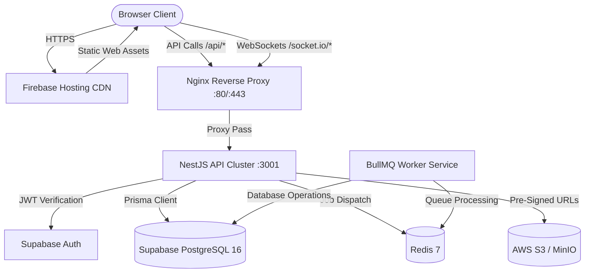

# MedCore HMS — Enterprise Hospital Management System

[](https://github.com/Aadarsh2021/Medcore-HMS/actions/workflows/ci.yml)


> **Enterprise Multi-Tenant Cloud-Native Healthcare & Clinical Information System**
> Architected for hospital networks and standalone medical centers. Features Supabase Auth authentication, Supabase PostgreSQL 16 persistence via Prisma ORM, Next.js 15 frontend deployed on Firebase Hosting, NestJS 10 backend modular monolith, Redis 7 / BullMQ asynchronous job scheduling, Socket.IO realtime push notifications, and S3-compatible medical document storage.

---

## Table of Contents
1. [Overview](#overview)
2. [Features](#features)
3. [Architecture](#architecture)
4. [Technology Stack](#technology-stack)
5. [Repository Structure](#repository-structure)
6. [Prerequisites](#prerequisites)
7. [Installation](#installation)
8. [Environment Variables](#environment-variables)
9. [Supabase Setup](#supabase-setup)
10. [Database Setup](#database-setup)
11. [Prisma Migrations](#prisma-migrations)
12. [Firebase Hosting](#firebase-hosting)
13. [Local Development](#local-development)
14. [Running API](#running-api)
15. [Running Web](#running-web)
16. [Running Redis](#running-redis)
17. [Running BullMQ Worker](#running-bullmq-worker)
18. [Running Tests](#running-tests)
19. [Linting](#linting)
20. [Typechecking](#typechecking)
21. [Production Build](#production-build)
22. [Docker](#docker)
23. [Deployment](#deployment)
24. [CI/CD](#cicd)
25. [Authentication](#authentication)
26. [Multi-Tenancy](#multi-tenancy)
27. [RBAC (9 System Roles)](#rbac-9-system-roles)
28. [Security](#security)
29. [File Storage](#file-storage)
30. [Realtime](#realtime)
31. [Notifications](#notifications)
32. [Audit Logging](#audit-logging)
33. [Billing & Payments](#billing--payments)
34. [Laboratory](#laboratory)
35. [Pharmacy](#pharmacy)
36. [Rooms & Beds](#rooms--beds)
37. [Patient Portal](#patient-portal)
38. [Analytics](#analytics)
39. [Troubleshooting](#troubleshooting)
40. [Health Checks](#health-checks)
41. [Production Checklist](#production-checklist)
42. [Known Limitations](#known-limitations)
43. [License](#license)

---

## Overview

MedCore HMS digitizes end-to-end outpatient (OPD) and inpatient (IPD) clinical, administrative, and diagnostic operations. Built with strict data integrity controls, the system guarantees zero data leakage between independent hospital tenants, protects against concurrent appointment slot collisions, enforces First-Expired First-Out (FEFO) pharmacy inventory dispensing, and maintains an immutable audit trail for clinical and financial events.

---

## Features

- **Multi-Tenant Hospital Isolation**: Application and Prisma Client extension layer tenancy with `hospitalId` scoping across all tables.
- **Granular RBAC**: 9 distinct operational roles with strict server-side permissions and endpoint guards.
- **Concurrency-Safe UHID Generation**: Transactional monotonically increasing Universal Hospital Identification Numbers (`UHID-YYYYMM-XXXXX`) resilient to race conditions.
- **Appointment Scheduling Engine**: Conflict detection preventing doctor double-booking via database unique constraints and service-level pre-checks.
- **Clinical EMR & Encounters**: Outpatient consultations, vital signs with automated BMI calculation, and ICD-10 clinical diagnoses.
- **Digital Prescriptions**: Structured medication orders, dosage directions, and server-side PDF generation.
- **Diagnostic Laboratory**: Test ordering, barcode specimen accessioning, structured result entry, reference ranges, and realtime critical value alerts.
- **Pharmacy & Batch Inventory**: Stock ledger tracking, batch expiration dates, FEFO dispensing, and low-stock alerts.
- **Billing & Invoicing**: Aggregated itemized patient bills, support for cash/POS, and Stripe/Razorpay webhook settlements.
- **Inpatient Bed Management**: Wards, rooms, and real-time bed status (`AVAILABLE`, `OCCUPIED`, `MAINTENANCE`) with atomic assignment locks.
- **Emergency Triage**: Emergency Severity Index (ESI 1–5) queue prioritizing high-acuity patients.
- **Background Tasks**: BullMQ workers over Redis for appointment reminders, expired batch quarantine, and no-show reconciliation.
- **Realtime Push**: Socket.IO gateway with hospital and user room isolation for critical lab and bed occupancy updates.
- **Medical File Storage**: S3-compatible backend (AWS S3 / MinIO) for encrypted attachments with time-limited pre-signed URLs.

---

## Architecture



- **Frontend**: Next.js 15 App Router statically exported to `apps/web/out/` and deployed to Firebase Hosting.
- **Backend**: NestJS 10 modular monolith running in Node 20+ with TypeScript.
- **Database**: PostgreSQL 16 hosted on Supabase, managed with Prisma ORM.
- **Cache & Jobs**: Redis 7 powering BullMQ queues and workers.
- **Storage**: AWS S3 or MinIO with path traversal defense and pre-signed URLs.

---

## Technology Stack

| Domain | Technology | Description |
|---|---|---|
| **Frontend Framework** | Next.js 15 | App Router with static export (`output: 'export'`) |
| **Frontend Styling** | Tailwind CSS & shadcn/ui | Modern, responsive clinical interface |
| **Frontend Hosting** | Firebase Hosting | Global CDN, automated SSL, custom domain routing |
| **Backend Framework** | NestJS 10 | Modular TypeScript architecture |
| **Authentication** | Supabase Auth | Cryptographic JWT tokens and user metadata |
| **ORM** | Prisma 5.22+ | Schema definitions, migrations, client tenant extension |
| **Database** | PostgreSQL 16 (Supabase) | 3NF relational schema with ACID transaction support |
| **Queue & Cache** | Redis 7 & BullMQ | Asynchronous background processing |
| **Realtime** | Socket.IO 4 | WebSocket bidirectional events with room isolation |
| **Object Storage** | AWS SDK v3 S3 | S3-compatible attachment storage |
| **Testing** | Jest & Supertest | 20 test suites, 401 integration tests |

---

## Repository Structure

```
Medcore-HMS/
├── apps/
│   ├── api/                  # NestJS API application (Port 3001)
│   │   ├── src/              # Modules: clinical, billing, pharmacy, lab, auth, etc.
│   │   └── test/             # 20 integration test specifications (401 tests)
│   └── web/                  # Next.js 15 Web frontend (Port 3000)
│       ├── src/              # Pages, components, hooks, realtime clients
│       └── out/              # Static export bundle for Firebase Hosting
├── packages/
│   └── types/                # Shared TypeScript contracts, DTOs & Enums
├── prisma/
│   ├── schema.prisma         # 29 Relational Prisma models
│   ├── migrations/           # 10 production migrations
│   └── seed.ts               # Clinical demonstration seed script
├── infrastructure/
│   └── nginx/                # Nginx reverse proxy configuration
├── docs/                     # Comprehensive architecture and operations runbooks
├── firebase.json             # Firebase Hosting deployment configuration
├── docker-compose.yml        # Docker Compose multi-service topology
└── package.json              # Monorepo pnpm workspace definition
```

---

## Prerequisites

- **Node.js**: `v20.x` or `v22.x` (LTS recommended)
- **pnpm**: `v9.x` or `v10.x` (`npm install -g pnpm`)
- **PostgreSQL 16**: Supabase cloud instance or local PostgreSQL
- **Redis 7**: Local Redis server or cloud Redis (Upstash / ElastiCache)
- **Docker Desktop** *(Optional)*: For containerized local stack

---

## Installation

```bash
# Clone the repository
git clone https://github.com/Aadarsh2021/Medcore-HMS.git
cd Medcore-HMS

# Install all monorepo dependencies
pnpm install

# Build shared types package
pnpm --filter @medcore/types build
```

---

## Environment Variables

Copy the provided environment templates:
```bash
cp .env.example .env
cp apps/api/.env.example apps/api/.env
cp apps/web/.env.example apps/web/.env.local
```

### Essential Backend Configuration (`apps/api/.env`):
```env
PORT=3001
NODE_ENV=development
DATABASE_URL="postgresql://postgres:[PASSWORD]@[HOST]:5432/postgres?connection_limit=10&pool_timeout=45&schema=public"
DIRECT_URL="postgresql://postgres:[PASSWORD]@[HOST]:5432/postgres?schema=public"
REDIS_URL="redis://localhost:6379"
SUPABASE_URL="https://[YOUR-PROJECT].supabase.co"
SUPABASE_ANON_KEY="[YOUR-ANON-KEY]"
SUPABASE_SERVICE_ROLE_KEY="[YOUR-SERVICE-ROLE-KEY]"
```

### Essential Frontend Configuration (`apps/web/.env.local`):
```env
NEXT_PUBLIC_API_URL="http://localhost:3001/api"
NEXT_PUBLIC_APP_URL="http://localhost:3000"
NEXT_PUBLIC_SUPABASE_URL="https://[YOUR-PROJECT].supabase.co"
NEXT_PUBLIC_SUPABASE_ANON_KEY="[YOUR-ANON-KEY]"
```

---

## Supabase Setup

1. Create a project at [supabase.com](https://supabase.com).
2. Note your **Project URL**, **Anon/Publishable Key**, and **Service Role Key**.
3. Under **Authentication > URL Configuration**, add your local (`http://localhost:3000`) and production (`https://[YOUR-FIREBASE-APP].web.app`) redirect URLs.
4. Set database password and configure Port 5432 or PgBouncer Port 6543 connection string.
5. Refer to [docs/SUPABASE.md](docs/SUPABASE.md) for full operational instructions.

---

## Database Setup

1. Configure `DATABASE_URL` and `DIRECT_URL` in `apps/api/.env`.
2. Generate the Prisma client:
   ```bash
   npx prisma generate
   ```
3. Seed demonstration clinical data (Hospitals, Doctors, Patients, Inventory):
   ```bash
   pnpm --filter @medcore/api prisma:seed
   ```

---

## Prisma Migrations

Apply production migrations to the database using `prisma migrate deploy`:
```bash
npx prisma migrate deploy
```

Verify migration status:
```bash
npx prisma migrate status
```
*Expected: "Database schema is up to date!"*

> [!WARNING]
> Never use `prisma db push` in production environments as it skips migration auditing and version tracking.

---

## Firebase Hosting

The web frontend is statically exported and served via Firebase Hosting.
1. Build the frontend:
   ```bash
   pnpm --filter @medcore/web build
   ```
2. Deploy to Firebase:
   ```bash
   firebase deploy --only hosting --project medcore-hms-eea8e
   ```
See [docs/FIREBASE_DEPLOYMENT.md](docs/FIREBASE_DEPLOYMENT.md) for domain configuration and rollback details.

---

## Local Development

Start development servers concurrently:
```bash
# Terminal 1: Backend API
pnpm --filter @medcore/api dev

# Terminal 2: Frontend Web
pnpm --filter @medcore/web dev
```

---

## Running API

```bash
pnpm --filter @medcore/api start:dev
```
- API Endpoint: `http://localhost:3001/api`
- Swagger Documentation: `http://localhost:3001/api/docs`

---

## Running Web

```bash
pnpm --filter @medcore/web dev
```
- Web Application: `http://localhost:3000`

---

## Running Redis

Ensure Redis 7 is listening on port 6379:
```bash
# Via Docker:
docker run -d --name medcore-redis -p 6379:6379 redis:7-alpine

# Verify:
redis-cli ping
# Output: PONG
```

---

## Running BullMQ Worker

The BullMQ background worker initializes automatically as part of the NestJS application lifecycle via `JobsModule`. To run standalone worker processes in clustered production environments, set `RUN_STANDALONE_WORKER=true`.

---

## Running Tests

Execute the 20-suite integration and e2e test suite:
```bash
pnpm --filter @medcore/api test -- --runInBand
```
- **Suites**: 20 passed
- **Tests**: 401 passed, 0 failed

---

## Linting

Check monorepo code style and rule compliance:
```bash
pnpm lint
```
*Expected: 0 errors.*

---

## Typechecking

Verify static typing across all workspaces:
```bash
pnpm --filter @medcore/types build
pnpm --filter @medcore/api exec tsc --noEmit
pnpm --filter @medcore/web exec tsc --noEmit
```
*Expected: 0 errors.*

---

## Production Build

```bash
# 1. Compile shared types
pnpm --filter @medcore/types build

# 2. Build NestJS API bundle
pnpm --filter @medcore/api build

# 3. Export Next.js static bundle to apps/web/out
pnpm --filter @medcore/web build
```

---

## Docker

Build and run the full stack via Docker Compose:
```bash
docker compose build
docker compose up -d
docker compose ps
```
Services included:
- `postgres` (PostgreSQL 16)
- `redis` (Redis 7)
- `api` (NestJS backend API)
- `web` (Next.js frontend)
- `nginx` (Reverse proxy on port 80/443)

---

## Deployment

Refer to the full [docs/DEPLOYMENT.md](docs/DEPLOYMENT.md) runbook for end-to-end cloud staging and production setups.

---

## CI/CD

Automated CI executes on GitHub Actions (`.github/workflows/ci.yml`):
- PostgreSQL 16 & Redis 7 services provisioned
- Prisma migration deployment verification
- ESLint code quality scan
- TypeScript typecheck on API & Web
- 20-suite sequential regression test run
- Production bundle build

---

## Authentication

Authentication is managed via **Supabase Auth**. Users authenticate via `/auth/login` or the Next.js login page and receive a cryptographically signed JWT. The NestJS API verifies the token and maps claims into `req.user`.

---

## Multi-Tenancy

Every tenant (hospital) is hermetically partitioned:
- Every tenant entity has a foreign key `hospitalId`.
- The `TenantHeaderGuard` enforces `x-hospital-id` matching.
- The Prisma Tenant Extension automatically injects `{ hospitalId }` filters on queries.
- Verified: Zero data visibility across hospitals.

---

## RBAC (9 System Roles)

MedCore strictly enforces 9 operational roles:

1. **SUPER_ADMIN**: Platform owner governance, hospital tenant creation, system-wide health and audit log inspection.
2. **HOSPITAL_ADMIN**: Manages hospital settings, onboarding staff, defining departments, wards, rooms, and billing schedules.
3. **DOCTOR**: Clinical patient consultations, recording vitals, ICD-10 diagnoses, issuing prescriptions, ordering laboratory tests.
4. **NURSE**: Patient triage intake, vitals recording, bed assignment oversight, and inpatient care notes.
5. **RECEPTIONIST**: Outpatient registration, deterministic UHID generation, appointment scheduling, and front-desk counter billing.
6. **LAB_TECHNICIAN**: Diagnostic test orders, barcode specimen accessioning, recording test results, and broadcasting critical alerts.
7. **PHARMACIST**: Medication catalog maintenance, inventory batch receiving, FEFO dispensing against prescriptions, and stock tracking.
8. **ACCOUNTANT**: Patient billing, itemized invoice generation, payment receipt issuance, and financial audit reconciliation.
9. **PATIENT**: Personal patient portal access to view past encounters, digital prescriptions, lab reports, and outstanding bills.

---

## Security

- **OWASP Hardening**: Helmet HTTP headers, CORS whitelisting, and strict DTO schema validation.
- **Rate Limiting**: NestJS Throttler protects API endpoints against brute force attacks.
- **SQL Injection Prevention**: Prisma ORM parameterized queries across all database calls.
- **Upload Hardening**: 20 MB size ceiling, MIME whitelist, and malicious file extension blocking.
- **Audit Logs**: Immutable database records for all critical patient, clinical, and financial actions.
See [docs/SECURITY.md](docs/SECURITY.md) for the complete security specification.

---

## File Storage

- Clinical attachments and prescription PDFs are stored in S3-compatible storage.
- Storage path format: `attachments/{hospitalId}/{patientId}/{uuid}.{ext}`.
- Pre-signed PUT/GET URLs ensure clients interact directly with S3 without exposing credentials.

---

## Realtime

- **Socket.IO** powers push notifications.
- Clients join tenant rooms (`hospital_{hospitalId}`) and personal rooms (`user_{userId}`).
- Realtime alerts triggered for critical lab results and inpatient bed status transitions.

---

## Notifications

- In-app notification queue.
- Resend API integration for email notifications.
- Twilio integration for SMS appointment confirmations.

---

## Audit Logging

- Centralized append-only audit log in PostgreSQL.
- Captures `hospitalId`, `userId`, `action`, `entityName`, `entityId`, `ipAddress`, and `correlationId`.

---

## Billing & Payments

- Itemized patient billing combining consultation, lab, and pharmacy charges.
- Payment methods: Cash, Card, and Online Checkout.
- Webhook signature verification for Stripe and Razorpay integrations.

---

## Laboratory

- Comprehensive laboratory workflow: Order -> Specimen Collection -> Barcode Accession -> Result Entry -> Supervisor Verification -> Critical Alert.

---

## Pharmacy

- Inventory item master and batch management.
- Expiration date tracking and First-Expired First-Out (FEFO) dispensing logic.
- Atomic stock decrements to prevent overselling.

---

## Rooms & Beds

- Inpatient management with Ward -> Room -> Bed hierarchy.
- Atomic bed occupancy transitions (`AVAILABLE` <-> `OCCUPIED`).
- Patient admission, transfer, and discharge tracking.

---

## Patient Portal

- Secure portal for registered patients.
- View upcoming appointments, access downloadable prescription PDFs, and view verified lab reports.

---

## Analytics

- Real-time hospital metrics: Bed occupancy rate, average length of stay (ALOS), department revenue, and appointment completion rates.

---

## Troubleshooting

### Issue: Concurrency test timeout on Supabase
- **Solution**: Configure `DATABASE_URL` with `connection_limit=10&pool_timeout=45`. This accommodates Supabase Session mode pool limits.

### Issue: Redis connection refused
- **Solution**: Ensure Redis 7 is running (`docker run -d -p 6379:6379 redis:7-alpine`) or update `REDIS_URL` in `apps/api/.env`.

---

## Health Checks

- **Liveness Probe**: `GET /api/health/live` returns HTTP 200 `{ status: "ok" }`.
- **Readiness Probe**: `GET /api/ready/ready` returns component health for PostgreSQL and Redis.

---

## Production Checklist

- [x] Database migrations applied via `npx prisma migrate deploy`
- [x] Environment files (`.env`) protected and sanitized
- [x] CORS origins set to production frontend domain
- [x] Supabase Auth redirect URLs configured
- [x] Redis 7 instance running with password authentication
- [x] S3 bucket CORS and lifecycle rules configured
- [x] SSL/TLS termination enabled at reverse proxy

---

## Known Limitations

- Self-hosted Redis required for BullMQ queues (mocked/in-memory in unit tests).
- Cloud S3 bucket required for live cloud attachment storage testing.

---

## License

This project is licensed under the MIT License — see the [LICENSE](LICENSE) file for details.
