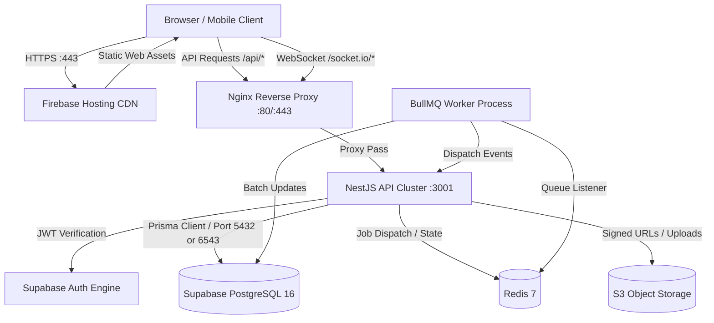
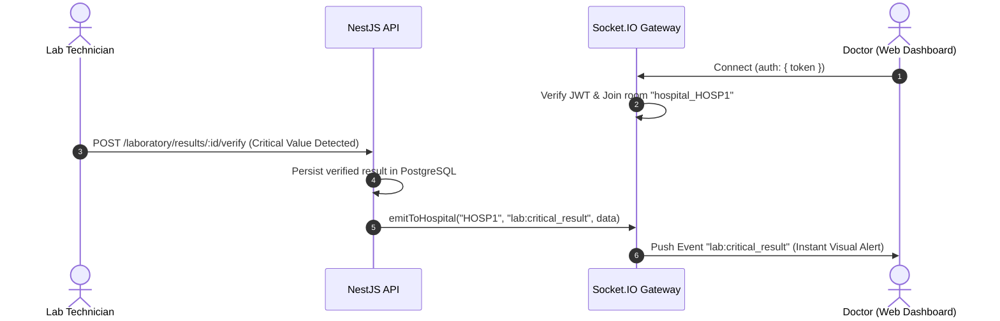
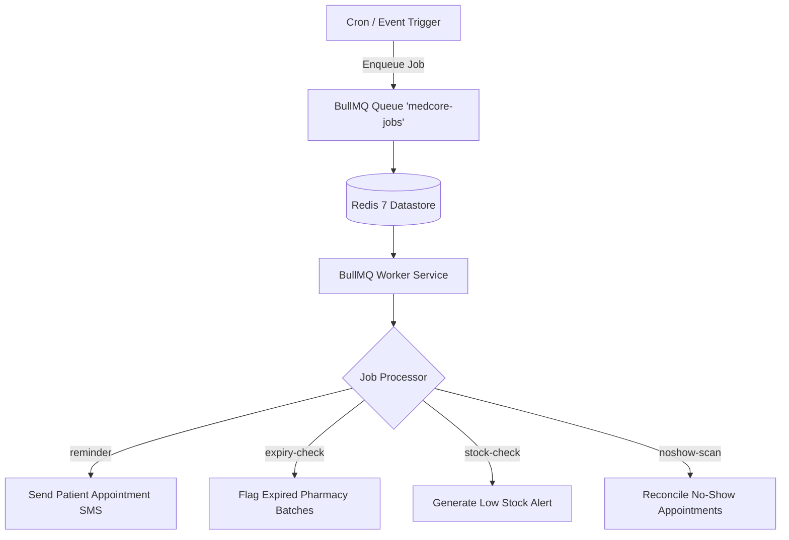

# MedCore HMS — System Architecture Documentation

## 1. Executive Architecture Summary

MedCore Hospital Management System (HMS) is an enterprise-grade, multi-tenant healthcare information system designed to support clinical, administrative, diagnostic, and financial workflows across hospitals.

The architecture follows a modern, decoupled topology:
- **Frontend Presentation Layer**: Next.js 15 App Router application compiled as a static client bundle deployed to **Firebase Hosting**.
- **Backend Application Layer**: NestJS 10 modular monolith REST & WebSocket API deployed as containerized services behind an Nginx reverse proxy.
- **Identity & Authentication**: **Supabase Auth** delivering cryptographically signed JWT tokens with role and tenant claims.
- **Database & Persistence**: **Supabase PostgreSQL 16** managed via **Prisma ORM**, augmented with a custom Prisma Client tenant-isolation extension and PostgreSQL row-level/transaction concurrency controls.
- **Asynchronous Task Processing**: **BullMQ** running over **Redis 7** for scheduled clinical jobs (expiry alerts, no-show reconciliation, appointment reminders).
- **Realtime Push Notifications**: **Socket.IO** Gateway with strict hospital-tenant and user room boundaries.
- **Medical File Storage**: S3-compatible object storage (AWS S3 / MinIO) for encrypted, tenant-partitioned clinical attachments and prescriptions.

---

## 2. Global Topology Diagram



---

## 3. Frontend Architecture (`apps/web`)

### 3.1 Framework & Build Pipeline
- **Next.js 15 (App Router)** configured in static export mode (`output: 'export'` in `next.config.ts`).
- Compiles into pre-rendered HTML/CSS/JS artifacts located in `apps/web/out/` for edge deployment via Firebase Hosting.
- Zero server runtime dependencies on the frontend host; all dynamic hospital operations interact directly with the backend API.

### 3.2 State Management & Network Layer
- **Client State**: React Context and lightweight state hooks for session persistence, active hospital tenant, and user profile.
- **API Client**: Strongly typed Axios client with automated Supabase JWT injection, correlation ID tracing (`x-correlation-id`), and tenant header provisioning (`x-hospital-id`).
- **Realtime Integration**: Custom `useRealtime` hook connecting to backend Socket.IO, subscribing to tenant-scoped rooms for instant bed updates and critical lab notifications.

### 3.3 Route Structure
- `/` & `/auth/*`: Supabase Login, Session Management, Password Recovery.
- `/dashboard`: Role-conditioned unified healthcare management hub.
- `/dashboard/patients/*`: Outpatient & Inpatient registry, UHID lookup, demographic profiles.
- `/dashboard/appointments/*`: Multi-provider scheduling calendar, slot conflict protection.
- `/dashboard/encounters/*`: Clinical examinations, vitals logging, ICD-10 diagnosis recording.
- `/dashboard/prescriptions/*`: Medication ordering, drug interaction verification, PDF generation.
- `/dashboard/laboratory/*`: Test orders, specimen collection, result verification, critical alert dispatch.
- `/dashboard/pharmacy/*`: Stock ledger, batch tracking, dispensing, FEFO expiration alerts.
- `/dashboard/billing/*`: Itemized invoice generation, payment gateway checkout, receipt creation.
- `/dashboard/rooms-beds/*`: Ward, room, and bed allocation, patient transfer, occupancy status.
- `/dashboard/triage/*`: Emergency triage classification (Emergency Severity Index 1–5).
- `/dashboard/analytics/*`: Hospital performance KPIs, bed turnover, revenue trends.

---

## 4. Backend Architecture (`apps/api`)

### 4.1 Framework & Core Modules
NestJS 10 modular monolith structured cleanly by clinical and administrative bounded contexts:
- `AuthModule`: Supabase JWT validation, user session verification, role synchronization.
- `HospitalsModule` & `DepartmentsModule`: Tenant provisioning and medical department hierarchy.
- `PatientsModule`: Patient demographics, medical history, deterministic UHID allocation.
- `AppointmentsModule`: Double-booking prevention, doctor schedule slots, no-show status handling.
- `EncountersModule`: Doctor consultation encounters, vitals recording, ICD-10 clinical diagnoses.
- `PrescriptionsModule`: Prescription issuance, dosage directions, PDF document rendering.
- `LaboratoryModule`: Lab test catalog, orders, specimen accessioning, barcode tracking, reference ranges.
- `PharmacyModule`: Pharmacy inventory items, batches, stock movements, dispensing idempotency.
- `BillingModule`: Invoices, line items, payments, Stripe & Razorpay webhook processing.
- `RoomsBedsModule`: Wards, rooms, beds, admission lifecycle, occupancy states.
- `TriageModule`: Emergency triage intake, priority classification, doctor assignment.
- `ClinicalDictionaryModule`: Standardized ICD-10 coding and medical term dictionary.
- `NotificationsModule`: Multi-channel notification delivery (In-app, Resend Email, Twilio SMS).
- `JobsModule`: BullMQ workers and cron dispatchers for scheduled operational maintenance.
- `RealtimeModule`: Socket.IO WebSocket gateway managing hospital and user room broadcasting.
- `StorageModule`: S3-compatible medical attachment storage with pre-signed upload/download URLs.
- `AuditModule`: Centralized append-only audit trail logging for HIPAA/GDPR compliance.
- `HealthModule`: Liveness and readiness probes inspecting PostgreSQL and Redis connectivity.

### 4.2 Security & Guard Pipeline

```mermaid
graph LR
    Req[Incoming HTTP Request] --> Trace[CorrelationLoggingInterceptor]
    Trace --> Helmet[Helmet Security Headers]
    Helmet --> RateLimit[ThrottlerGuard Rate Limiter]
    RateLimit --> AuthG[SupabaseAuthGuard]
    AuthG --> TenantG[TenantHeaderGuard]
    TenantG --> RolesG[RolesGuard RBAC]
    RolesG --> Validation[ValidationPipe DTO Whitelist]
    Validation --> Controller[Target Controller Handler]
```



1. **CorrelationLoggingInterceptor**: Generates or propagates `X-Correlation-Id` across logs and HTTP response headers.
2. **Helmet**: Enforces CSP, HSTS, X-Content-Type-Options, X-Frame-Options (`DENY`), and Referrer-Policy.
3. **ThrottlerGuard**: Prevents denial-of-service and brute-force attempts with IP and user tier rate limits.
4. **SupabaseAuthGuard**: Extracts and verifies Bearer JWT against Supabase Auth public key or remote verification.
5. **TenantHeaderGuard**: Validates that non-SuperAdmin requests specify an authorized `x-hospital-id` matching the user's tenant permissions.
6. **RolesGuard**: Checks user role against `@Roles(...)` metadata across 9 granular system roles.
7. **ValidationPipe**: Strict DTO transformation with `whitelist: true` and `forbidNonWhitelisted: true`.

---

## 5. Database & Multi-Tenancy Architecture

### 5.1 Multi-Tenant Isolation Strategy
- **Shared Database, Shared Schema with Tenant Discriminator**: Every tenant-bound entity contains a foreign key `hospitalId` indexed for low-latency queries.
- **Application-Layer Tenant Enforcement**:
  - The custom Prisma Client extension (`prisma-tenant.extension.ts`) intercepts queries and automatically injects `{ hospitalId: currentTenantId }` filters on read/write operations when invoked within a tenant context.
  - Controllers and services enforce explicit `where: { id, hospitalId }` predicates on all mutation operations to prevent IDOR (Insecure Direct Object Reference).
- **Concurrency Locks & Unique Constraints**:
  - **UHID Generation**: Employs transactional row locks (`pg_advisory_xact_lock` or sequence counter rows) to prevent duplicate UHIDs during burst registration.
  - **Appointment Slot Overlap**: Database-level unique constraint `[doctorId, appointmentDate, startTime]` prevents double-booking.
  - **Bed Occupancy**: Transactional check and atomic update prevent two patients from being assigned to the same bed simultaneously.
  - **Pharmacy Stock**: Atomic `UPDATE ... SET currentStock = currentStock - :qty WHERE currentStock >= :qty` ensures zero inventory overselling.

---

## 6. Realtime Communication Architecture



- **Authentication**: WebSocket handshake requires valid Supabase JWT in `auth.token`.
- **Room Isolation**:
  - `hospital_{hospitalId}`: Receives hospital-wide administrative, bed status, and critical diagnostic alerts.
  - `user_{userId}`: Receives personal notifications, assignment alerts, and direct messages.
  - Prevents cross-tenant information leakage: Clients cannot join arbitrary rooms without matching tenant claims.

---

## 7. Storage Architecture (Medical Attachments)

- **S3 Bucket Structure**:
  ```
  s3://medcore-storage-bucket/
  ├── attachments/
  │   └── {hospitalId}/
  │       └── {patientId}/
  │           └── {uuid}.{ext}
  └── prescriptions/
      └── {hospitalId}/
          └── {patientId}/
              └── {prescriptionNumber}.pdf
  ```
- **Security Invariants**:
  - Path traversal protection rejects `..`, `/`, and `\` characters in file keys.
  - MIME whitelist restricted to `application/pdf`, `image/jpeg`, `image/png`, `image/webp`.
  - Dangerous extensions (`.exe`, `.sh`, `.bat`, `.cmd`, `.js`, `.html`, `.svg`, `.php`, `.py`) are rejected.
  - Maximum upload size capped at 20 MB.
  - Time-limited Pre-Signed URLs (TTL: 900 seconds) for direct secure download and upload without exposing AWS credentials to clients.

---

## 8. Asynchronous Processing & Background Jobs



- **Resilience**: Jobs are configured with exponential backoff (3 attempts, initial delay 2,000ms).
- **Deterministic Job IDs**: Deduplication keys prevent duplicate reminders or batch runs within identical execution windows.
- **Graceful Shutdown**: Workers listen to NestJS `onModuleDestroy` hooks to finish in-flight jobs before terminating.

---

## 9. Payment Webhook Architecture

- **Stripe & Razorpay Integration**:
  - Webhooks delivered to `/billing/webhooks/stripe` and `/billing/webhooks/razorpay`.
  - Raw body signature verification ensures payload integrity and prevents spoofing.
  - Idempotent processing records payment transaction IDs to guarantee invoices cannot be credited multiple times.
  - On successful settlement, invoice status transitions to `PAID`, and payment receipt is automatically generated.
