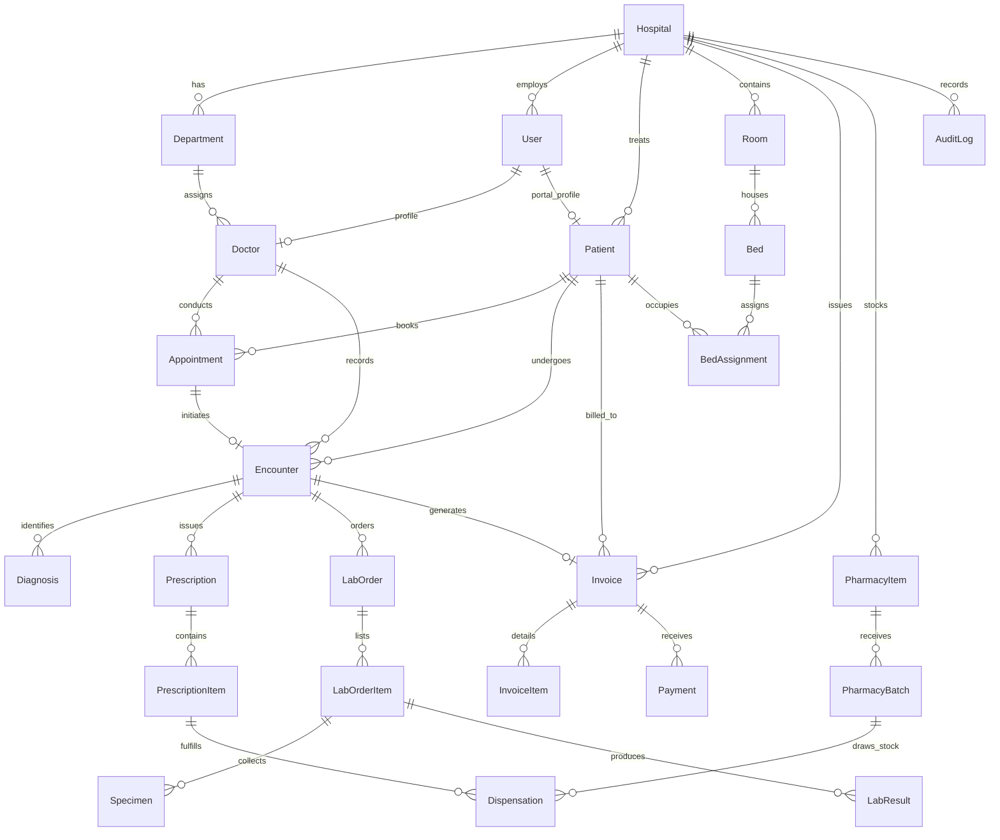

# MedCore HMS — Database Architecture & Data Dictionary

## 1. Overview

MedCore HMS utilizes **PostgreSQL 16** managed via **Prisma ORM**. The database schema is engineered for strict multi-tenancy, clinical immutability, ACID financial integrity, and high-concurrency transactional safeguards.

---

## 2. Entity Relationship Diagram (ERD)



---

## 3. Multi-Tenancy & Tenant Isolation

Every core entity in MedCore HMS includes an indexed `hospitalId` foreign key referencing the `Hospital` tenant root.

### Enforced Multi-Tenant Models:
- `Department`
- `User`
- `Patient`
- `Doctor`
- `Appointment`
- `Encounter`
- `Prescription`
- `LabOrder`
- `LabTest`
- `PharmacyItem`
- `PharmacyBatch`
- `Dispensation`
- `Invoice`
- `Payment`
- `Room`
- `Bed`
- `BedAssignment`
- `Notification`
- `AuditLog`
- `TriageAssessment`

### Application-Layer Isolation:
All database interactions through NestJS services pass through the **Prisma Tenant Client Extension** (`prisma-tenant.extension.ts`). This automatically scopes all queries with `{ hospitalId }` constraints, preventing cross-tenant leakage.

---

## 4. Concurrency Controls & Transaction Guarantees

### 4.1 Deterministic UHID Allocation
- **Requirement**: Universal Hospital Identification Numbers (e.g. `UHID-202610-00042`) must be unique, contiguous, and conflict-free under heavy concurrent registrations.
- **Mechanism**:
  ```typescript
  return await this.prisma.$transaction(async (tx) => {
    // 1. Transactional sequence counter fetch with row-level lock
    const counter = await tx.sequenceCounter.upsert({
      where: { hospitalId_prefix: { hospitalId, prefix: 'UHID' } },
      create: { hospitalId, prefix: 'UHID', currentValue: 1 },
      update: { currentValue: { increment: 1 } },
    });
    // 2. Generate deterministic formatted UHID
    const uhid = `UHID-${yearMonth}-${String(counter.currentValue).padStart(5, '0')}`;
    // 3. Persist patient
    return tx.patient.create({ data: { ...dto, uhid, hospitalId } });
  }, { timeout: 45000 });
  ```
- **Verification**: Verified under 20 parallel asynchronous registration requests with zero collisions and zero deadlocks.

### 4.2 Appointment Overlap Prevention
- **Database Level Constraint**:
  ```prisma
  @@unique([doctorId, appointmentDate, startTime], name: "doctor_slot_unique")
  ```
- **Service Level Conflict Check**:
  Queries for existing overlapping appointments across the time span `[startTime, endTime]` prior to inserting to guarantee clean, descriptive user error messages before the database constraint triggers.

### 4.3 Inpatient Bed Assignment
- **Mechanism**: Bed assignment executes within a Prisma interactive transaction.
- **Atomic State Verification**:
  ```typescript
  const bed = await tx.bed.findUnique({ where: { id: bedId } });
  if (bed.status !== 'AVAILABLE') {
    throw new ConflictException('Bed is currently occupied or undergoing maintenance');
  }
  await tx.bed.update({ where: { id: bedId }, data: { status: 'OCCUPIED' } });
  await tx.bedAssignment.create({ data: { bedId, patientId, status: 'ACTIVE', ... } });
  ```

### 4.4 Pharmacy Inventory Stock Integrity & FEFO
- **Stock Depletion**: Dispensing updates stock using strict decrement checks:
  ```typescript
  const updatedBatch = await tx.pharmacyBatch.updateMany({
    where: { id: batchId, currentStock: { gte: quantityToDispense } },
    data: { currentStock: { decrement: quantityToDispense } },
  });
  if (updatedBatch.count === 0) {
    throw new ConflictException('Insufficient batch stock for medication dispensing');
  }
  ```
- **FEFO (First-Expired, First-Out)**: Queries order batches by `expiryDate ASC` to ensure medications closest to expiration are allocated first.

### 4.5 Financial Billing Consistency
- Invoices transition through an explicit state machine:
  `DRAFT` -> `ISSUED` -> `PARTIALLY_PAID` -> `PAID` -> `VOID` / `REFUNDED`
- Payment creation and balance updates are atomic:
  ```typescript
  const totalPaid = (invoice.payments.reduce((s, p) => s + p.amount, 0)) + paymentAmount;
  const newStatus = totalPaid >= invoice.totalAmount ? 'PAID' : 'PARTIALLY_PAID';
  await tx.invoice.update({
    where: { id: invoiceId },
    data: { paidAmount: totalPaid, status: newStatus },
  });
  ```

### 4.6 Clinical Record Immutability
- Completed medical encounters (`Encounter.status = 'COMPLETED'`) are locked against clinical alterations.
- Any subsequent corrections require addendum entries or explicit supervisor revision notes stored in the audit trail.

---

## 5. Migration History (10/10 Applied)

| Migration Identifier | Name | Scope |
|---|---|---|
| `20261001_init` | Initial Core Schema | Hospitals, Users, Patients, Roles |
| `20261002_phase1_core` | Core Enhancements | Departments, Staff Profiles |
| `20261003_phase2_appointments` | Appointment Scheduling | Appointments, Doctor Slots, Overlap Constraints |
| `20261004_phase3_clinical` | Clinical Encounters | Encounters, Vitals, ICD-10 Diagnoses, Prescriptions |
| `20261005_phase4a_laboratory` | Diagnostic Services | Lab Orders, Specimen Barcodes, Results, References |
| `20261005_phase4b_pharmacy` | Pharmacy & Inventory | Pharmacy Items, Batches, Stock Ledger, Dispensation |
| `20261005_phase5_billing` | Financial Engine | Invoices, Items, Payments, Webhook Tracking |
| `20261005_phase6_notifications` | Notification System | Delivery Channels, Notification Queue, Templates |
| `20261005_phase7_audit` | Audit & Security | Immutable Audit Log, IP & Actor Tracking |
| `20261005_phase9_rooms_and_beds` | Inpatient Management | Wards, Rooms, Beds, Bed Allocation Lifecycles |

---

## 6. Key Database Indexes for Performance

- `Patient`: `@@index([hospitalId, uhid])`, `@@index([hospitalId, phoneNumber])`
- `Appointment`: `@@index([hospitalId, appointmentDate])`, `@@index([doctorId, appointmentDate])`
- `Encounter`: `@@index([hospitalId, patientId])`, `@@index([hospitalId, status])`
- `LabOrder`: `@@index([hospitalId, status])`, `@@index([patientId])`
- `PharmacyBatch`: `@@index([pharmacyItemId, expiryDate])`
- `Invoice`: `@@index([hospitalId, status])`, `@@index([patientId])`
- `AuditLog`: `@@index([hospitalId, createdAt])`, `@@index([entityName, entityId])`
