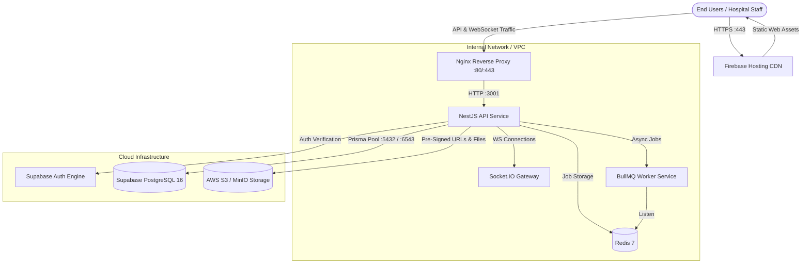

# MedCore HMS — Production & Staging Deployment Runbook

## 1. Production Deployment Topology



---

## 2. Infrastructure Prerequisites Checklist

Before executing the deployment, ensure the following cloud services are provisioned:
1. **Supabase Project**: An active project with PostgreSQL 16 and Supabase Auth enabled.
2. **Redis 7 Instance**: Local Docker container, AWS ElastiCache, or Upstash instance.
3. **S3-Compatible Bucket**: AWS S3 bucket or MinIO instance with private read/write ACLs.
4. **Firebase Project**: Initialized Firebase project with Hosting enabled (`medcore-hms-eea8e`).
5. **DNS & SSL**: Domain names configured for web frontend and API reverse proxy.

---

## 3. Step-by-Step Deployment Procedure

### Step 1: Database Migration Deployment
Apply all 10 schema migrations to the Supabase PostgreSQL database using the direct connection URL:
```bash
# Ensure DIRECT_URL points to Supabase Port 5432
export DIRECT_URL="postgresql://postgres:[PASSWORD]@[HOST]:5432/postgres?schema=public"

npx prisma migrate deploy
```
Verify the migration state:
```bash
npx prisma migrate status
```
*Expected: "Database schema is up to date!"*

### Step 2: S3 Object Storage Bucket Configuration
Create your S3 bucket (e.g. `medcore-storage-bucket`) and configure CORS rules to permit pre-signed uploads from your frontend domain:
```json
[
  {
    "AllowedHeaders": ["*"],
    "AllowedMethods": ["PUT", "GET", "HEAD"],
    "AllowedOrigins": ["https://medcore-hms-eea8e.web.app", "https://hms.yourdomain.com"],
    "ExposeHeaders": ["ETag"]
  }
]
```

### Step 3: Backend API & Worker Deployment (Docker Stack)
The repository provides a complete containerized stack in `docker-compose.yml`.

1. Prepare the production environment file:
   ```bash
   cp apps/api/.env.example apps/api/.env
   # Edit apps/api/.env with real production database, redis, and auth credentials
   ```
2. Build and start the services:
   ```bash
   docker compose build
   docker compose up -d
   ```
3. Inspect container health:
   ```bash
   docker compose ps
   ```

### Step 4: Health & Readiness Verification
Perform live HTTP smoke checks against the API:
```bash
# 1. Liveness check
curl -f http://localhost:3001/api/health/live

# 2. Readiness check (Verifies live database & Redis connections)
curl -f http://localhost:3001/api/health/ready
```

### Step 5: Frontend Build & Firebase Hosting Deployment
1. Configure client environment:
   ```bash
   cp apps/web/.env.example apps/web/.env.local
   # Ensure NEXT_PUBLIC_API_URL points to your production API endpoint (e.g., https://api.yourdomain.com/api)
   ```
2. Build and compile static assets:
   ```bash
   pnpm --filter @medcore/types build
   pnpm --filter @medcore/web build
   ```
3. Deploy to Firebase Hosting:
   ```bash
   firebase deploy --only hosting --project medcore-hms-eea8e
   ```

---

## 4. Reverse Proxy & Nginx Configuration

The provided `infrastructure/nginx/nginx.conf` handles:
- SSL termination (Certbot / Let's Encrypt certificates).
- Web routing to `/` and API proxy pass to `/api`.
- WebSocket upgrade headers (`Upgrade $http_upgrade`, `Connection "upgrade"`) for Socket.IO realtime events.
- Client body size limit configured to `25M` to accommodate 20 MB medical file uploads.

---

## 5. Rollback Procedures

### Frontend Rollback (Firebase)
```bash
firebase hosting:rollback
```
Instantly restores the previous static asset bundle across all global edge nodes.

### Backend Rollback (Docker)
1. Tag previous stable container image before deploying new version:
   ```bash
   docker tag medcore-api:latest medcore-api:previous
   ```
2. In case of failure:
   ```bash
   docker service update --image medcore-api:previous medcore_api
   # or with docker compose:
   docker compose down
   docker compose up -d
   ```

### Database Migration Rollback
Prisma does not provide automated down-migrations. If a migration needs reversal:
1. Create a compensating forward migration using `npx prisma migrate dev --name revert_xxx`.
2. Apply the forward migration with `npx prisma migrate deploy`.
