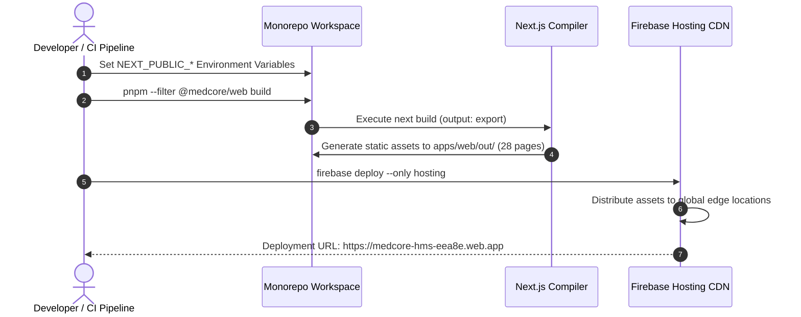

# MedCore HMS — Firebase Hosting Deployment Guide

## 1. Executive Summary

The frontend application (`apps/web`) of MedCore HMS is built with Next.js 15 App Router and configured for high-performance static export (`output: 'export'`). The compiled HTML, JavaScript, CSS, and asset bundles are hosted on **Firebase Hosting**.

This architecture delivers:
- Global edge content delivery through Google's CDN with low latency.
- High availability with DDoS mitigation and automatic SSL certificate provisioning.
- Zero server maintenance and zero cold-start latency for the frontend.

---

## 2. Configuration Files Overview

### 2.1 `firebase.json`
Located in the repository root:
```json
{
  "hosting": {
    "public": "apps/web/out",
    "ignore": [
      "firebase.json",
      "**/.*",
      "**/node_modules/**"
    ],
    "cleanUrls": true,
    "rewrites": [
      {
        "source": "**",
        "destination": "/index.html"
      }
    ],
    "headers": [
      {
        "source": "**/*",
        "headers": [
          {
            "key": "X-Content-Type-Options",
            "value": "nosniff"
          },
          {
            "key": "X-Frame-Options",
            "value": "DENY"
          },
          {
            "key": "X-XSS-Protection",
            "value": "1; mode=block"
          },
          {
            "key": "Referrer-Policy",
            "value": "strict-origin-when-cross-origin"
          }
        ]
      },
      {
        "source": "/_next/static/**",
        "headers": [
          {
            "key": "Cache-Control",
            "value": "public, max-age=31536000, immutable"
          }
        ]
      }
    ]
  }
}
```

### 2.2 `.firebaserc`
Contains the project alias mapping:
```json
{
  "projects": {
    "default": "medcore-hms-eea8e"
  }
}
```

### 2.3 `apphosting.yaml`
Specifies App Hosting configurations if using next-gen Firebase App Hosting backend builds.

---

## 3. Build & Deployment Workflow



### 3.1 Step 1: Environment Variable Preparation
Before triggering the build, client-facing environment variables must be populated:
```env
NEXT_PUBLIC_API_URL="https://api.medcorehms.com/api"
NEXT_PUBLIC_APP_URL="https://medcore-hms-eea8e.web.app"
NEXT_PUBLIC_SUPABASE_URL="https://[YOUR-PROJECT-REF].supabase.co"
NEXT_PUBLIC_SUPABASE_ANON_KEY="[YOUR-SUPABASE-ANON-KEY]"
NEXT_PUBLIC_FIREBASE_API_KEY="[YOUR-FIREBASE-API-KEY]"
NEXT_PUBLIC_FIREBASE_APP_ID="[YOUR-FIREBASE-APP-ID]"
NEXT_PUBLIC_FIREBASE_MEASUREMENT_ID="[YOUR-MEASUREMENT-ID]"
```

### 3.2 Step 2: Monorepo Compilation
Build the shared types package and the Next.js web application:
```bash
# 1. Build dependencies
pnpm --filter @medcore/types build

# 2. Compile and statically export web application
pnpm --filter @medcore/web build
```
Verify that the `apps/web/out/` directory contains all 28 static HTML files and asset bundles.

### 3.3 Step 3: Firebase Deployment
Authenticate with Firebase and deploy:
```bash
# Optional interactive login if not authenticated
firebase login

# Deploy hosting target
firebase deploy --only hosting --project medcore-hms-eea8e
```

For non-interactive CI/CD deployment, use a service account token:
```bash
firebase deploy --only hosting --token "$FIREBASE_TOKEN"
```

---

## 4. Rollback Procedure

If an unintended regression occurs post-release:
1. List previous deployment releases:
   ```bash
   firebase hosting:releases
   ```
2. Rollback to a known healthy version:
   ```bash
   firebase hosting:rollback
   ```
   Or select a specific release version in the Firebase Console under **Hosting > Release History**.

---

## 5. Custom Domain & HTTPS

1. Navigate to the Firebase Console: **Build > Hosting > Add custom domain**.
2. Enter your hospital domain (e.g., `hms.medcore.health` or `app.yourhospital.org`).
3. Add the provided DNS TXT records to verify domain ownership.
4. Add the A records pointing to Google's edge IPs.
5. Firebase automatically provisions and renews SSL/TLS certificates through Let's Encrypt.

---

## 6. Current Verification Status

- **Configuration Status**: **VERIFIED**
  - `firebase.json` verified with correct `apps/web/out` path and SPA rewrites.
  - `.firebaserc` points to `medcore-hms-eea8e`.
  - Next.js build passes cleanly with 28 static pages exported to `apps/web/out`.
- **Remote Cloud Execution Status**: **PENDING FIREBASE CREDENTIALS**
  - Active Firebase CLI session requires authenticated service account token `FIREBASE_TOKEN` or `GOOGLE_APPLICATION_CREDENTIALS` in GitHub Secrets.
