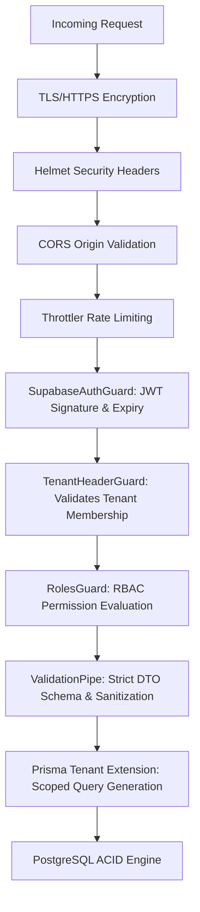

# MedCore HMS — Security & Compliance Architecture

## 1. Security Overview

MedCore HMS is engineered to comply with international healthcare privacy and security standards, including **HIPAA** (Health Insurance Portability and Accountability Act) and **GDPR** (General Data Protection Regulation).

The security baseline guarantees:
- Strict cryptographic authentication via Supabase Auth.
- Fine-grained Role-Based Access Control (RBAC) across 9 distinct hospital roles.
- Hermetic tenant isolation ensuring zero data leakage across hospitals.
- Full auditability for clinical and financial events.
- Defensive validation against OWASP Top 10 web vulnerabilities.

---

## 2. Role-Based Access Control (RBAC) Matrix

MedCore defines 9 first-class operational roles:

| Role | Primary Purpose | Permitted Modules | Restricted / Forbidden Modules |
|---|---|---|---|
| **SUPER_ADMIN** | Platform owner, system maintenance | Cross-tenant hospital management, global audit logs, health metrics | Patient clinical records across individual hospitals without explicit audit justification |
| **HOSPITAL_ADMIN** | Hospital tenant administration | Staff onboarding, departments, rooms, wards, hospital audit logs, hospital billing | Direct clinical diagnosis creation (unless also credentialed as doctor) |
| **DOCTOR** | Primary clinical provider | Patient history, appointments, encounters, vitals, diagnoses, prescriptions, lab ordering, bed admission requests | Staff HR salary configuration, system settings |
| **NURSE** | Inpatient care & vitals | Bed occupancy, vitals recording, triage assessment, medication administration tracking | Issuing new prescriptions, approving final lab verifications |
| **RECEPTIONIST** | Front desk, patient intake | Patient registration (UHID), appointment scheduling, visitor check-in, initial triage routing | Clinical notes, lab results, medication dispensing |
| **LAB_TECHNICIAN** | Diagnostic laboratory | Lab orders, specimen collection/accessioning, test result entry, critical value reporting | Prescriptions, general billing, room allocations |
| **PHARMACIST** | Pharmacy & medication dispensing | Medication catalog, inventory batches, dispensing fulfillment against valid prescriptions, stock ledger | Altering clinical encounter notes, booking appointments |
| **ACCOUNTANT** | Hospital billing & financial accounting | Invoices, payments, refund processing, billing analytics, insurance claims | Direct clinical diagnoses, prescribing medications |
| **PATIENT** | Patient portal user | Viewing personal health record, personal appointments, personal prescriptions, personal invoices | Other patients' records, any staff/admin interfaces |

---

## 3. Defense-in-Depth Pipeline

---

## 4. Multi-Tenant Isolation

1. **Header Validation (`TenantHeaderGuard`)**:
   - Every authenticated request requires the `x-hospital-id` header.
   - For all roles except `SUPER_ADMIN`, the guard asserts that `req.user.hospitalId === req.headers['x-hospital-id']`. Mismatched requests are immediately rejected with `403 Forbidden`.
2. **Prisma Client Tenant Extension**:
   - Injects `{ hospitalId }` constraints into generated queries.
   - Prevents Insecure Direct Object Reference (IDOR) attacks where an attacker alters IDs in URL paths.

---

## 5. Input Validation & Injection Defenses

- **SQL Injection**: Prevented categorically by **Prisma ORM**, which utilizes parameterized SQL statements across all queries. Raw SQL queries are prohibited in business code.
- **DTO Validation (`ValidationPipe`)**:
  - `whitelist: true`: Automatically strips extraneous fields not declared in the DTO.
  - `forbidNonWhitelisted: true`: Immediately halts and rejects payloads containing unauthorized properties.
  - Type coercion and transformation via `class-transformer` and `class-validator`.

---

## 6. Medical File Upload & Storage Security

All attachments uploaded to the object storage subsystem pass through rigorous sanitization in `StorageService`:
- **Path Traversal Protection**: Rejects file keys containing `..`, absolute paths `/`, or backslashes `\`.
- **MIME Type Allowlist**: Strictly restricted to:
  - `application/pdf`
  - `image/jpeg`
  - `image/png`
  - `image/webp`
- **Dangerous File Extension Rejection**: Rejects `.exe`, `.sh`, `.bat`, `.cmd`, `.js`, `.html`, `.svg`, `.php`, `.py`.
- **Payload Size Restriction**: Enforces a strict 20 MB ceiling per upload.
- **Temporary Pre-Signed URLs**: S3 upload and download operations utilize temporary pre-signed URLs with a 900-second (15-minute) TTL, keeping S3 credentials hermetically sealed on the backend.

---

## 7. Webhook Signature Verification

- **Stripe Webhooks**: Validates `Stripe-Signature` using Stripe's SDK and HMAC-SHA256 with `STRIPE_WEBHOOK_SECRET`.
- **Razorpay Webhooks**: Validates `x-razorpay-signature` using HMAC-SHA256 with `RAZORPAY_KEY_SECRET`.
- **Raw Body Handling**: The API preserves raw request bodies on webhook routes to prevent signature verification failures caused by JSON body parsing mutations.

---

## 8. Immutable Audit Trail

All critical operations generate an immutable record in `AuditLog`:
- **Tracked Attributes**:
  - `id`: UUID primary key
  - `hospitalId`: Tenant scope
  - `userId`: Identity of actor
  - `action`: E.g., `PATIENT_REGISTERED`, `PRESCRIPTION_ISSUED`, `PAYMENT_RECEIVED`
  - `entityName`: Target model (e.g., `Patient`, `Invoice`)
  - `entityId`: Record identifier
  - `details`: JSON payload of operation or state delta
  - `ipAddress`: Remote client IP address
  - `correlationId`: Trace identifier for end-to-end log correlation
  - `createdAt`: Immutable UTC timestamp

---

## 9. Production Security Checklist

- [x] Passwords hashed using bcrypt/argon2 via Supabase Auth
- [x] Zero hardcoded API keys or secrets in source code
- [x] Environment files (`.env`) ignored by git
- [x] Helmet security headers active (`X-Frame-Options: DENY`, `X-Content-Type-Options: nosniff`)
- [x] CORS restricted to authorized frontend origins
- [x] Rate limiting active (ThrottlerGuard)
- [x] Pre-signed S3 URLs with short TTL (900s)
- [x] Strict tenant isolation enforced in Prisma client extension
- [x] Webhook endpoints protected with cryptographic HMAC signatures
- [x] Audit logs record user actions and IP addresses
