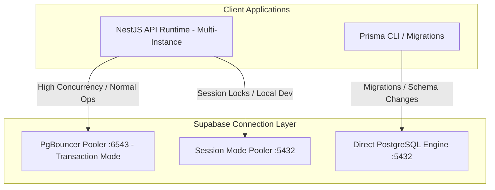

# MedCore HMS — Supabase Integration & Production Operations

## 1. Overview

MedCore HMS utilizes **Supabase** for two primary infrastructural tiers:
1. **Supabase Auth**: Managed Identity, JWT token generation, and secure password hashing.
2. **Supabase Hosted PostgreSQL 16**: High-availability relational database storing clinical records, transactions, and multi-tenant hospital data managed via Prisma ORM.

---

## 2. Public vs. Private Credential Classification

It is vital to maintain strict separation between public client-side keys and private administrative credentials:

| Key Name | Exposure Domain | Intended Usage | Security Level |
|---|---|---|---|
| `NEXT_PUBLIC_SUPABASE_URL` | Public (Browser/Client) | Frontend Supabase SDK initialization | Safe for browser bundle |
| `NEXT_PUBLIC_SUPABASE_ANON_KEY` | Public (Browser/Client) | Public client anonymous operations & sign-in | Safe for browser bundle |
| `SUPABASE_URL` | Private (Backend API) | Backend Supabase client communication | Restricted to server environment |
| `SUPABASE_ANON_KEY` | Private (Backend API) | Backend token verification | Restricted to server environment |
| `SUPABASE_SERVICE_ROLE_KEY` | **STRICTLY PRIVATE** | Administrative user provisioning & sync | **CRITICAL: NEVER expose to browser** |
| `DATABASE_URL` | **STRICTLY PRIVATE** | Prisma database client runtime connection | **CRITICAL: NEVER expose to browser** |
| `DIRECT_URL` | **STRICTLY PRIVATE** | Direct port 5432 migration execution | **CRITICAL: NEVER expose to browser** |

> [!CAUTION]
> The `SUPABASE_SERVICE_ROLE_KEY` bypasses all database Row Level Security policies and grants administrative control. It must only ever be configured in secure backend server environments (`apps/api/.env`) or CI/CD secret vaults.

---

## 3. Supabase Project Setup & Auth Configuration

### 3.1 Project Creation
1. Navigate to the [Supabase Dashboard](https://supabase.com/dashboard) and create a new project (e.g., `medcore-hms-production`).
2. Select an AWS region close to your primary hospital deployments (e.g., `ap-south-1` Mumbai or `us-east-1` N. Virginia).
3. Set a strong database password (32+ alphanumeric characters).

### 3.2 Authentication Settings
1. **Email Authentication**: Enable Email / Password login.
2. **Email Confirmations**:
   - For Staging/Production: Enable email confirmations if self-registration for patients is enabled.
   - For Staff Accounts: Hospital staff accounts are typically created directly by Hospital Admins using the Admin API.
3. **Site URL & Redirect URLs**:
   - **Site URL**: `https://<your-firebase-app>.web.app` (or your custom domain `https://hms.yourdomain.com`)
   - **Allowed Redirect URLs**:
     - `http://localhost:3000/**` (Local development)
     - `https://<your-firebase-app>.web.app/**` (Production Firebase Hosting)
     - `https://<your-firebase-app>.firebaseapp.com/**`
4. **JWT Expiration**: Set access token expiration to 3600 seconds (1 hour). MedCore API uses Supabase refresh tokens for seamless session renewal.

### 3.3 User Metadata & Role Mapping
When staff or patient users are created in Supabase Auth, MedCore HMS stores their application role and hospital affiliation inside `raw_user_meta_data`:
```json
{
  "role": "DOCTOR",
  "hospitalId": "hosp_clx8910abcdef"
}
```
The NestJS `SupabaseAuthGuard` parses these claims directly from the verified JWT payload:
- `req.user.id`: Supabase Auth UUID (`auth.users.id`)
- `req.user.email`: User email address
- `req.user.role`: System role (e.g., `DOCTOR`, `NURSE`, `HOSPITAL_ADMIN`)
- `req.user.hospitalId`: Associated tenant ID

---

## 4. PostgreSQL Connection Modes & Connection Pooling

Supabase provides two distinct endpoints for database connections:



### 4.1 Port 5432: Session Mode / Direct Connection
- Connects directly to the underlying PostgreSQL instance or through PgBouncer in Session mode.
- **Server Pool Ceiling**: Default Supabase micro/small instances have a session connection limit (typically 15–30 max connections).
- **Prisma Configuration Recommendation**:
  When using Port 5432, you **must** configure client-side connection pooling limits to avoid `remaining connection slots are reserved for non-replication superuser connections` errors:
  ```env
  DATABASE_URL="postgresql://postgres:[PASSWORD]@[HOST]:5432/postgres?connection_limit=10&pool_timeout=45&schema=public"
  ```
  This setting limits each API instance to 10 connections and allows queued transactions up to 45 seconds to acquire a connection. This configuration was rigorously verified in MedCore's 20-concurrent UHID registration test.

### 4.2 Port 6543: PgBouncer Transaction Mode
- Ideal for high-concurrency production deployments across horizontally scaled API containers.
- Shares a connection pool across thousands of ephemeral client connections.
- **Notice on Prepared Statements**: Prisma must connect with `?pgbouncer=true` when connecting to Port 6543 to disable client-side prepared statement caching:
  ```env
  DATABASE_URL="postgresql://postgres:[PASSWORD]@[HOST]:6543/postgres?pgbouncer=true&connection_limit=20&schema=public"
  ```

### 4.3 Direct Connection for Migrations (`DIRECT_URL`)
Prisma migration commands (`prisma migrate deploy`) require advisory locks and ALTER TABLE statements that are unsupported in PgBouncer transaction mode.
Always configure `DIRECT_URL` pointing to Port 5432 for migrations:
```env
DIRECT_URL="postgresql://postgres:[PASSWORD]@[HOST]:5432/postgres?schema=public"
```

---

## 5. Migration Strategy & Certification

> [!IMPORTANT]
> **NEVER use `prisma db push` in production or staging environments.**
> `prisma db push` bypasses migration history, risks silent data loss, and does not record migration checksums.

### 5.1 Applying Migrations in Staging & Production
Execute all pending migrations using:
```bash
npx prisma migrate deploy
```
To verify the migration status:
```bash
npx prisma migrate status
```
Expected output:
```
Database schema is up to date!
```

---

## 6. Multi-Tenancy & Row-Level Security (RLS)

### 6.1 Architectural Decision: Application-Layer Tenant Isolation
- MedCore HMS implements multi-tenancy at the **Application and Prisma Client extension layer** rather than PostgreSQL RLS.
- **Rationale**:
  1. High performance: Avoids overhead of per-query session context switching (`SET LOCAL app.current_tenant_id`).
  2. Granular business logic: Enables complex cross-tenant aggregation for SuperAdmins and analytics while enforcing zero cross-tenant leakage for regular staff.
  3. Strict ORM integration: Prisma Client extension automatically enforces `{ hospitalId }` on all standard reads and writes.

---

## 7. Backups, Disaster Recovery & Production Hardening

1. **Automated Backups**: Enable Supabase Daily Backups (included in Supabase Pro tier with Point-in-Time Recovery - PITR).
2. **Network Restrictions**: In production, configure Supabase IP allowlisting to permit connections only from your API servers' static outbound IPs.
3. **SSL Mode**: Always ensure connections use `sslmode=require` in production database connection strings.
4. **Log Retention**: Configure Supabase Postgres log retention to at least 30 days for clinical audit compliance.
