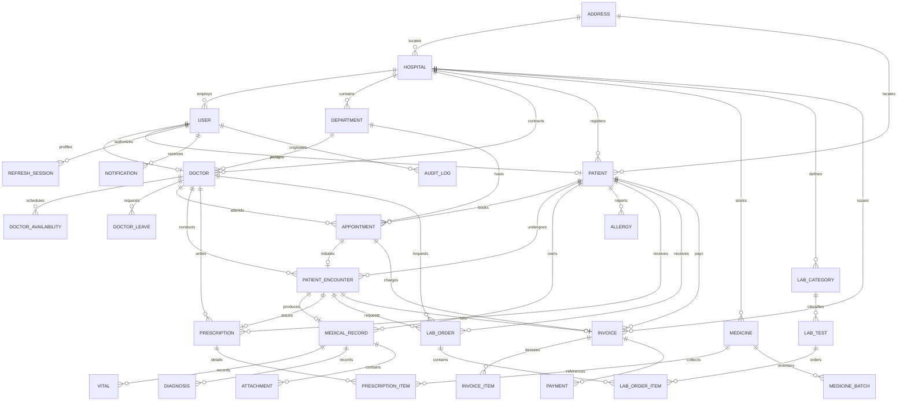

# MedCore HMS — Entity Relationship & Schema Documentation

## Database Engine: PostgreSQL 16 (Relational 3NF)
**ORM**: Prisma ORM  
**Multi-Tenancy Model**: Row-Level Multi-Tenancy (`hospitalId`)

## Schema Entities Summary (29 Models)

| Entity | Primary Keys & Indexes | Core Role & Invariants |
| :--- | :--- | :--- |
| **Hospital** | `id` (PK), `slug` (UQ), `code` (UQ) | Tenant boundary. Scopes all hospital operations. |
| **Address** | `id` (PK) | Shared normalized address table for hospitals and patients. |
| **User** | `id` (PK), `email` (UQ), `[hospitalId, role]` | Authentication principal. Null hospitalId for SUPER_ADMIN. |
| **RefreshSession** | `id` (PK), `tokenHash` (UQ), `[userId, deviceId]` | Refresh token rotation with session reuse detection. |
| **Department** | `id` (PK), `[hospitalId, code]` (UQ) | Specialty units (Cardiology, Pediatrics, etc.). |
| **Doctor** | `id` (PK), `userId` (UQ), `[hospitalId, departmentId]` | Clinician profile, license, fees, signature. |
| **DoctorAvailability** | `id` (PK), `[doctorId, dayOfWeek]` | Weekly recurring schedule template and slot duration. |
| **DoctorLeave** | `id` (PK), `[doctorId, startDate]` | Blackout dates preventing slot generation. |
| **Patient** | `id` (PK), `userId` (UQ), `[hospitalId, uhid]` (UQ) | Patient master with Unique Hospital ID and blood group. |
| **Appointment** | `id` (PK), `[doctorId, appointmentDate, startTime]` | Scheduling core. Concurrency-protected via row lock. |
| **PatientEncounter** | `id` (PK), `appointmentId` (UQ) | Consultation workflow session (Check-in -> Consultation -> Complete). |
| **MedicalRecord** | `id` (PK), `encounterId` (UQ), `[hospitalId, patientId]` | Append-only clinical EMR document. |
| **Vital** | `id` (PK), `[recordId]` | Vitals with calculated BMI (`weight / (height/100)^2`). |
| **Diagnosis** | `id` (PK), `[recordId]` | ICD-10 mapped provisional or confirmed diagnoses. |
| **Allergy** | `id` (PK), `[patientId]` | Allergen, severity, and reaction records. |
| **Attachment** | `id` (PK), `[recordId]` | PHI files with S3 pre-signed private URLs. |
| **Prescription** | `id` (PK), `encounterId` (UQ) | Signed clinical prescription header. |
| **PrescriptionItem** | `id` (PK), `[prescriptionId]` | Drug, dose, frequency, duration, route, instructions. |
| **Medicine** | `id` (PK), `[hospitalId, name]`, `[hospitalId, category]` | Pharmacy catalog with reorder threshold. |
| **MedicineBatch** | `id` (PK), `[medicineId, batchNumber]` (UQ) | FIFO batch inventory tracking with expiry date quarantine. |
| **LabCategory** | `id` (PK), `[hospitalId, name]` (UQ) | Diagnostic categories (Hematology, Biochemistry, etc.). |
| **LabTest** | `id` (PK), `[hospitalId, code]` (UQ) | Test catalog with reference ranges, sample type, turnaround. |
| **LabOrder** | `id` (PK), `[hospitalId, patientId]` | Doctor diagnostic order. |
| **LabOrderItem** | `id` (PK), `[orderId]` | Specimen status, structured result, abnormal flag, approval. |
| **Invoice** | `id` (PK), `[hospitalId, invoiceNumber]` (UQ) | Itemized bill aggregating consultation, lab, and pharmacy. |
| **InvoiceItem** | `id` (PK), `[invoiceId]` | Line item detail with unit price and quantity. |
| **Payment** | `id` (PK), `[hospitalId, invoiceId]` | Cash or digital transaction record. |
| **Notification** | `id` (PK), `[userId, status]` | Multi-channel user notifications. |
| **AuditLog** | `id` (PK), `[hospitalId, entityName]`, `[userId, createdAt]` | Immutable audit trail of state changes. |
