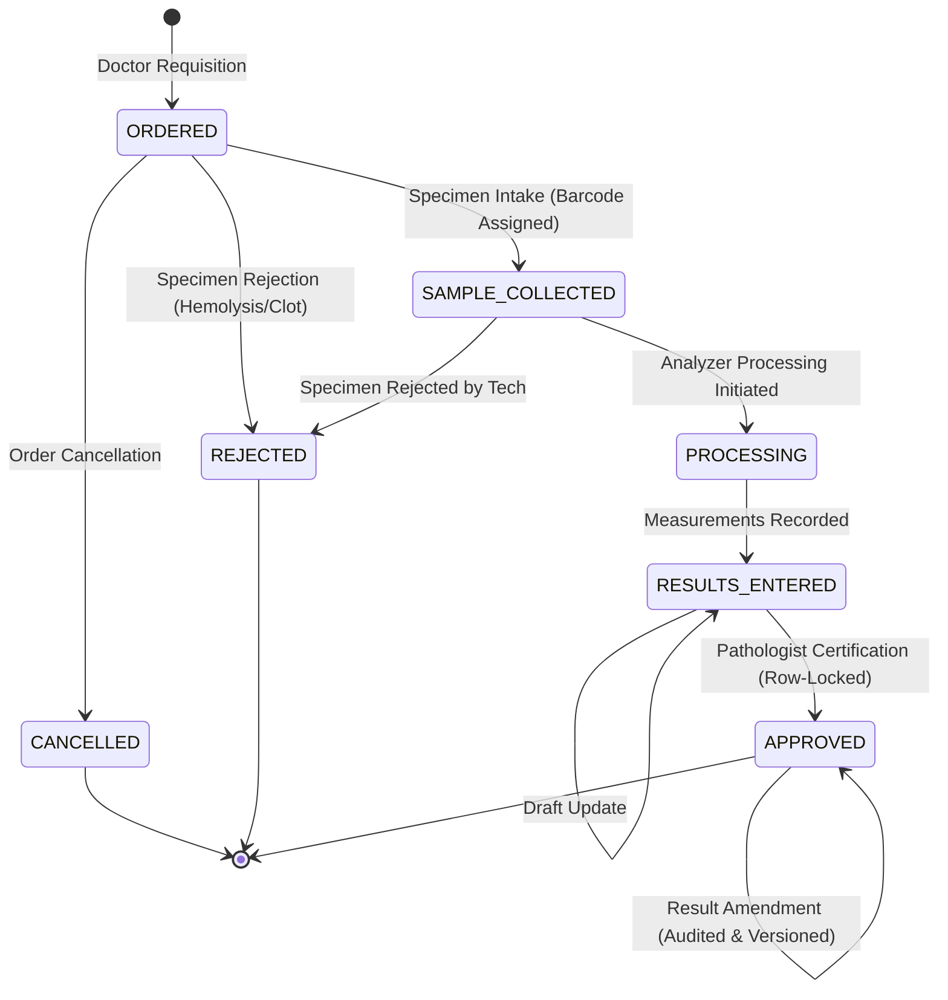

# MedCore HMS — Phase 8 Laboratory & Diagnostics Architecture

## 1. Executive Summary
Phase 8 introduces the comprehensive, production-grade **Laboratory & Diagnostics** backend module for MedCore HMS. It seamlessly integrates with the existing frozen frontend workspaces, preserving 100% of the Phase 1–7 tenant isolation, RBAC, Supabase authentication, and Prisma extensions.

---

## 2. Clinical Domain Architecture

### Key Architectural Invariants:
1. **Clinical State Machine:**
   - Strict transition enforcement: Orders progress strictly from `ORDERED` → `SAMPLE_COLLECTED` → `PROCESSING` → `RESULTS_ENTERED` → `APPROVED`.
   - Invalid jumps (e.g., `ORDERED` direct to `APPROVED` or `ORDERED` direct to `PROCESSING`) are strictly rejected with `400 Bad Request`.
   - Terminal states: `CANCELLED` and `REJECTED`. Cancellation is prohibited once specimens are in analyzer processing or approved.

2. **Authoritative Range & Critical Panic Values:**
   - Critical panic thresholds (`criticalLow`, `criticalHigh`) are persisted test-specific configurations on `LabTest`.
   - The server calculates authoritative flags: `NORMAL`, `LOW`, `HIGH`, `CRITICAL`.
   - Client-submitted flags are ignored. Generic heuristic rules (e.g. >2× upper or <0.5× lower) are strictly prohibited.

3. **Concurrency-Safe Sequence Generation:**
   - **Order Numbers (`LAB-YYYY-000001`):** Generated using atomic PostgreSQL UPSERT row locking on `LabOrderNumberCounter` (`ON CONFLICT ("hospitalId", "year") DO UPDATE SET "lastNumber" = "lastNumber" + 1 RETURNING "lastNumber"`).
   - **Accession Barcodes (`ACC-YYYY-000001`):** Generated using atomic PostgreSQL UPSERT row locking on `LabAccessionCounter`.
   - Zero in-memory counters; collision-safe under high concurrent race loads.

4. **Post-Approval Immutability & Clinical Amendments:**
   - Once an order reaches `APPROVED`, results are sealed and immutable. Direct mutations are blocked.
   - Clinical corrections must proceed through `POST /api/laboratory/orders/:id/amend`, which records the previous value, new value, clinical justification reason, certifier name, and timestamp into `LabResultAmendment` while updating the current measurement.

5. **Atomic Pathologist Certification:**
   - Order approval uses PostgreSQL `SELECT ... FOR UPDATE` row-level locks.
   - Concurrent approval races guarantee that exactly one transaction succeeds while concurrent duplicate attempts fail with clean error handling.

---

## 3. Database Schema Design

### Core Models:
- **`LabOrder`**: Diagnostic requisition record, hospital-scoped, unique `(hospitalId, orderNumber)`. Supports optional `encounterId` for outpatient direct walk-ins.
- **`LabOrderItem`**: Individual test line item, linked to `LabTest`, storing measured text/numeric values, unit override, reference range, authoritative flag, and critical indicator.
- **`LabSpecimen`**: Physical specimen container tracking accession number, collector, received time, analyzer processor, and rejection status.
- **`LabResultAmendment`**: Immutable historical audit trail for post-approval result corrections.
- **`LabOrderNumberCounter` & `LabAccessionCounter`**: Hospital- and year-scoped atomic sequence tables.

---

## 4. Multi-Tenant Isolation
All laboratory models are registered in `apps/api/src/database/prisma-tenant.extension.ts`:
- **Direct Tenant Models:** `LabOrder`, `LabOrderNumberCounter`, `LabAccessionCounter`, `LabSpecimen`, `LabResultAmendment`.
- **Indirect Tenant Models:** `LabOrderItem` (scoped through `orderId`).
- **Foreign Key Constraints:** Validates that `patientId`, `doctorId`, `encounterId`, and `testId` all belong to the active hospital facility. Cross-tenant relations fail with `400 Bad Request` or `403 Forbidden`.
