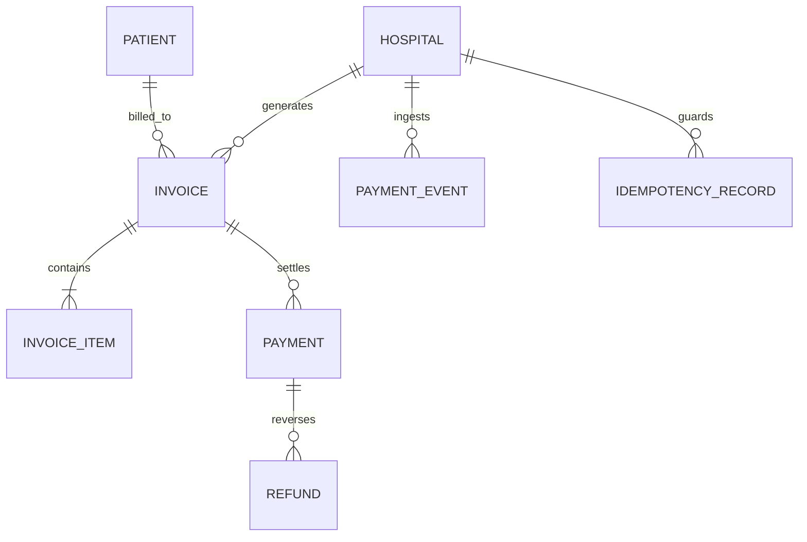
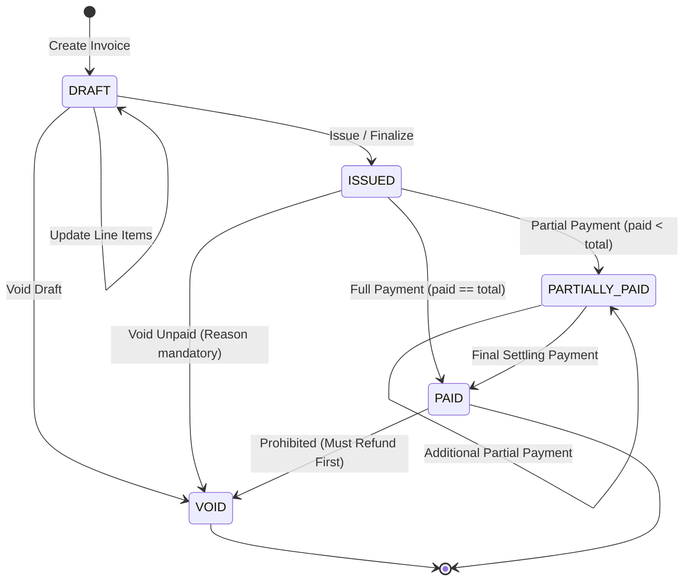
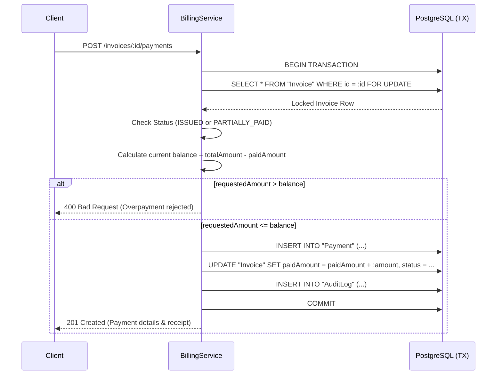

# Phase 9 — Billing, Invoicing & Payments: System Architecture

**Project**: MedCore HMS  
**Phase**: Phase 9 — Billing, Invoicing & Payments  
**Date**: September 17, 2026  
**Status**: FROZEN FOR PRODUCTION IMPLEMENTATION

---

## 1. Domain Separation & Data Boundaries

The MedCore HMS financial core strictly segregates financial state across distinct domain entities:



### 1.1 Core Entities & Boundaries
1. **Invoice (`Invoice`)**:
   - Master financial obligation document representing billable clinical and healthcare services.
   - Hospital-scoped, immutable upon issuance.
   - Tracks authoritative financial balances: `subtotal`, `taxAmount`, `discountAmount`, `totalAmount`, `paidAmount`, `refundedAmount`, and derived `outstandingAmount`.
2. **InvoiceLineItem (`InvoiceItem`)**:
   - Discrete billable items (Consultation, Lab Test, Pharmacy Dispensing, Procedures, Room/Bed, Consumables).
   - Contains unit price, quantity, discount, tax, and line total.
   - Optionally references originating clinical records (`appointmentId`, `encounterId`, `prescriptionId`, `labOrderId`, `labTestId`).
3. **Payment (`Payment`)**:
   - An explicit, verifiable transfer of monetary value credited towards an invoice.
   - Captures method (`CASH`, `CARD`, `UPI`, `BANK_TRANSFER`, `STRIPE`, `RAZORPAY`, `INSURANCE`), provider references, status, and collector identity.
4. **Refund (`Refund`)**:
   - Financial reversal against a specific successful payment.
   - Enforces invariant: `refund.amount <= payment.refundableAmount` and `invoice.refundedAmount <= invoice.paidAmount`.
5. **PaymentProviderEvent (`PaymentProviderEvent`)**:
   - Immutable audit log of inbound webhooks from external gateways (Stripe, Razorpay).
   - Prevents duplicate webhook event replay and verifies cryptographic signatures.
6. **IdempotencyRecord (`IdempotencyRecord`)**:
   - Tenant-scoped persistence layer preventing double payments or duplicate invoice mutations caused by network retries.
7. **AuditLog (`AuditLog`)**:
   - Central compliance trail for all financial mutations with zero leakage of payment credentials.

---

## 2. Server-Authoritative Financial Computation & Rounding Rules

### 2.1 The Golden Rule of Money Handling
**The client is NEVER trusted for monetary calculations.** All subtotals, taxes, discounts, totals, balances, and refunds are calculated authoritatively by the backend using PostgreSQL `NUMERIC(12, 2)` / Prisma `Decimal`.

### 2.2 Mathematical Execution Order
For each line item $i$:
1. **Line Subtotal**:
   $$\text{lineSubtotal}_i = \text{round}_2(\text{quantity}_i \times \text{unitPrice}_i)$$
2. **Line Discount**:
   $$\text{lineDiscount}_i = \text{clamp}(0, \text{lineSubtotal}_i, \text{round}_2(\text{discountInput}_i))$$
3. **Taxable Base**:
   $$\text{taxableBase}_i = \text{lineSubtotal}_i - \text{lineDiscount}_i$$
4. **Line Tax**:
   $$\text{lineTax}_i = \text{round}_2(\text{taxableBase}_i \times \text{taxRate}_i)$$
5. **Line Total**:
   $$\text{lineTotal}_i = \text{taxableBase}_i + \text{lineTax}_i$$

For the aggregate invoice:
1. **Invoice Subtotal**:
   $$\text{subtotal} = \sum_{i} \text{lineSubtotal}_i$$
2. **Invoice Discount**:
   $$\text{discountAmount} = \sum_{i} \text{lineDiscount}_i + \text{invoiceLevelDiscount}$$
3. **Invoice Tax**:
   $$\text{taxAmount} = \sum_{i} \text{lineTax}_i$$
4. **Invoice Total Amount**:
   $$\text{totalAmount} = \text{subtotal} - \text{discountAmount} + \text{taxAmount}$$
5. **Outstanding Balance**:
   $$\text{outstandingAmount} = \max(0.00, \text{totalAmount} - \text{paidAmount})$$

### 2.3 Rounding Rule
- Half-up rounding to two decimal places (`Math.round((val + Number.EPSILON) * 100) / 100` or `Decimal.round(2)`).
- Boundary conditions (e.g. quantity $\le 0$, unit price $< 0$, discount $>$ subtotal) are rejected at the DTO layer with HTTP 400.

---

## 3. Invoice State Machine



### 3.1 State Invariants
- **`DRAFT`**:
  - Fully mutable: items may be added, updated, or removed.
  - No payments can be applied until issued.
- **`ISSUED`**:
  - Immutability engaged: line items, quantities, and prices are permanently locked.
  - Payments can be accepted.
- **`PARTIALLY_PAID`**:
  - Locked: items immutable.
  - Additional payments accepted up to `outstandingAmount`.
- **`PAID`**:
  - Locked: `paidAmount >= totalAmount`.
  - Zero outstanding balance. Additional payments rejected.
- **`VOID`**:
  - Terminal state: no further payments or modifications permitted.
  - Requires mandatory `voidReason` and authoring actor attribution.

---

## 4. Payment Concurrency & Row Locking Architecture

### 4.1 Anti-Race Payment Flow
Payment processing executes within an interactive PostgreSQL transaction with row-level locks on the target `Invoice` to prevent concurrent overpayments:



---

## 5. Multi-Tenant Idempotency Engine

### 5.1 Request Fingerprinting
- Idempotency key is scoped strictly to `hospitalId`.
- A SHA-256 fingerprint is generated from:
  $$\text{hash} = \text{SHA-256}(\text{endpoint} + \text{canonicalJson}(\text{requestBody}))$$
- **Replay Behavior**:
  1. If `(hospitalId, key)` does not exist: record pending, execute transaction, save HTTP response status and body, return result.
  2. If `(hospitalId, key)` exists and `existing.requestHash === current.requestHash`: immediately return saved response without re-executing transactions.
  3. If `(hospitalId, key)` exists but `existing.requestHash !== current.requestHash`: reject with HTTP 409 `ConflictException('Idempotency key reused with different payload')`.

---

## 6. Payment Provider Abstraction & Webhook Security

### 6.1 Gateway Architecture
The backend exposes a unified `PaymentProvider` interface:
```typescript
export interface PaymentProvider {
  createOrder(invoice: Invoice, amount: Decimal): Promise<ProviderOrderResponse>;
  verifyWebhookSignature(payload: string | Buffer, signature: string, secret: string): boolean;
  parseWebhookEvent(payload: Record<string, any>): ParsedWebhookEvent;
  initiateRefund(payment: Payment, amount: Decimal, reason: string): Promise<ProviderRefundResponse>;
}
```
- Real offline payments (`CASH`, `UPI`, `CARD`, `BANK_TRANSFER`, `INSURANCE`) are recorded directly as `MANUAL`.
- External gateways (`RAZORPAY`, `STRIPE`) create pending orders and await authenticated webhooks.
- **Zero fake payment success**: The server never returns `Payment successful` unless authoritative payment confirmation exists.

---

## 7. Role-Based Access Control (RBAC)

- **`ACCOUNTANT`**: Full financial management (Invoices, Payments, Refunds, Reports).
- **`HOSPITAL_ADMIN`**: Full financial management within active hospital facility.
- **`RECEPTIONIST`**: Operational cashiering (Create invoices for walk-ins/encounters, collect payments against issued invoices). No refunds or void authority without admin/accountant.
- **`DOCTOR`**: View-only billing access for assigned patients/encounters. Cannot issue unauthorized voids or refunds.
- **`PATIENT`**: Read-only access to own invoices and payment history. Cannot inspect other patients' invoices or access hospital ledger reports.
- **`SUPER_ADMIN`**: Cross-hospital oversight requiring explicit `x-hospital-id` targeting.
- **`LAB_TECHNICIAN` / `PHARMACIST` / `NURSE`**: Restricted from unrestricted financial administration.
