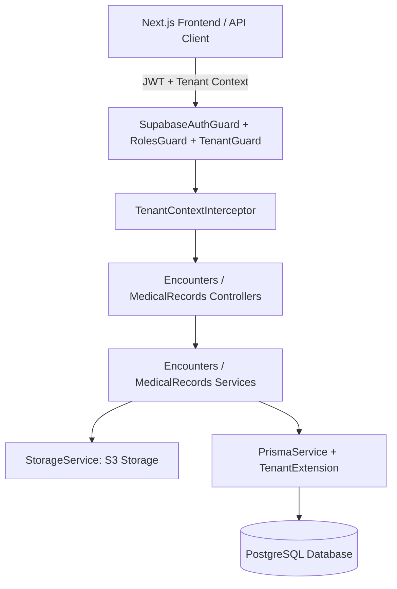
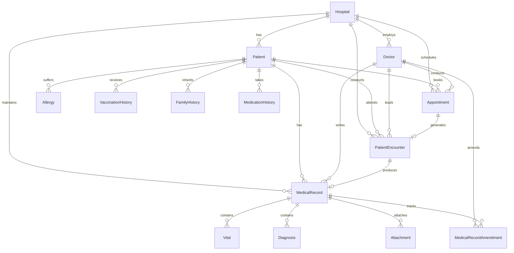

# PHASE 5 — REVISED ARCHITECTURE SPECIFICATION
# Clinical Encounters & Electronic Medical Records (EMR)

**Version:** 2.0.0 (Hardened)  
**Status:** APPROVED FOR IMPLEMENTATION  
**Module:** EMR & Clinical Encounters Architecture  

---

## 1. Architectural Overview

MedCore HMS Phase 5 implements the clinical core following clean architecture principles.
The architecture decouples the clinical domain into three complementary layers:
1. **Encounter Orchestration Layer (`EncountersService`, `EncountersController`)**: Manages the lifecycle of an outpatient visit, appointment linkage, clinician ownership, and state transitions.
2. **Clinical EMR Layer (`MedicalRecordsService`, `MedicalRecordsController`)**: Manages clinical notes, vitals, diagnoses, treatment plans, longitudinal patient history, and append-only amendments.
3. **Data Integrity & Storage Layer (`StorageService`, `PrismaTenantExtension`)**: Enforces multi-tenant row isolation, atomic database transactions, secure S3 attachment storage via pre-signed URLs, and audit logging.

---

## 2. Clinical Domain Model & ER Classification

### 2.1 Entity Classification: Encounter-Scoped vs. Patient-Longitudinal

To prevent data duplication and maintain clinical integrity, clinical entities are partitioned into two strict scopes:

| Scope | Entities | Relationship & Storage Model | Rationale |
| :--- | :--- | :--- | :--- |
| **Encounter-Scoped** | `PatientEncounter` `MedicalRecord` `Vital` `Diagnosis` `Attachment` `MedicalRecordAmendment` | Direct child of `Appointment` / `PatientEncounter` / `MedicalRecord`. Linked to a specific clinical visit event. | Capture the point-in-time clinical observation, complaints, measurements, and diagnosis for a single clinical encounter. |
| **Patient-Longitudinal** | `Allergy` `MedicationHistory` `VaccinationHistory` `FamilyHistory` | Direct child of `Patient` (`patientId`), with optional origin `recordId`. Persists across the patient's entire lifetime. | Patient safety information (e.g. penicillin anaphylaxis, hypertension family risk, childhood vaccines, chronic medications) must remain permanently visible across all future encounters and departments. |

### 2.2 Tenancy Model: Indirect Tenant Entities (Conforming to ADR-001)

An architectural evaluation of `Allergy` and patient-longitudinal history was conducted:
- In `prisma/schema.prisma`, `Allergy` has `patientId` referencing `Patient.id`.
- `Patient` has a direct `hospitalId`.
- In `prisma-tenant.extension.ts`, `Allergy` is already registered as an `INDIRECT_TENANT_MODEL` via `patient`.
- Adding a redundant `hospitalId` column to `Allergy`, `VaccinationHistory`, `FamilyHistory`, or `MedicationHistory` would introduce **duplicate tenant state** that could get out of sync with `Patient.hospitalId`.
- **Architectural Decision**: Conforming to ADR-001 Section 1.C, all patient-longitudinal entities (`Allergy`, `VaccinationHistory`, `FamilyHistory`, `MedicationHistory`) are modeled with `patientId` (mandatory) and `recordId` (optional). They are registered in `INDIRECT_TENANT_MODELS` via `relation: 'patient'`, ensuring 100% tenant safety without redundant columns.

---

## 3. Encounter Completion Invariants

The encounter completion contract defines exact clinical requirements:

### 3.1 Completion Invariant Rules
1. **Encounter Status**:
   - Must currently be in `EncounterStatus.IN_PROGRESS`. Attempting to complete an encounter with status `CHECKED_IN`, `COMPLETED`, or `CANCELLED` is rejected with `400 Bad Request`.
2. **Clinician Authorization**:
   - Must be executed by the **assigned doctor** (`encounter.doctorId === authenticatedDoctor.id`).
3. **Mandatory Clinical Fields**:
   - `chiefComplaint`: Mandatory non-empty string (minimum 3 characters). An encounter cannot be closed without documenting the presenting complaint.
   - `diagnoses`: Mandatory. Must contain at least **one** diagnosis (either `PROVISIONAL` or `CONFIRMED`). In medical-legal practice, an encounter without a diagnostic impression is clinically invalid.
4. **Optional Clinical Fields**:
   - `presentingSymptoms`: Optional (may be subsumed in chief complaint).
   - `clinicalNotes`: Optional.
   - `treatmentPlan`: Optional (not all consultations require a new medication/treatment plan, e.g. review normal test results).
   - `vitals`: Optional (follow-ups or tele-consultations may not record a complete vitals panel).
   - `attachments`: Optional.
   - `followUpDate`: Optional.
5. **Emergency / Exceptional Encounters**:
   - For emergency triage encounters, clinicians may record a provisional diagnosis (e.g. `"Acute chest pain under evaluation"`) with urgent referral notes and complete the encounter.
6. **Atomic State Synchronization**:
   - `PatientEncounter.status` transitions to `COMPLETED` with `completedAt = new Date()`.
   - `Appointment.status` transitions to `COMPLETED` atomically within the same database transaction.
   - `MedicalRecord` base fields are finalized and locked against direct edits.

---

## 4. Strict Append-Only Amendment Model (ADR-006)

To satisfy the legal and PRD mandate that **medical records are append-only**:
1. **Draft State (`IN_PROGRESS`)**:
   During active consultation, the doctor may edit draft fields (`chiefComplaint`, `presentingSymptoms`, `clinicalNotes`, `treatmentPlan`, `followUpDate`), record vitals, and add diagnoses.
2. **Finalized State (`COMPLETED`)**:
   Once completed, the `MedicalRecord` is permanently locked.
   Any direct `PUT` or `PATCH` to the base record is rejected with `409 Conflict`.
3. **Additive Amendment Model (`MedicalRecordAmendment`)**:
   - An amendment **NEVER modifies the original `MedicalRecord` row**. The original notes, diagnosis, and creation timestamps remain 100% permanent and unmodified.
   - Amendments are stored as child records:
     - `id`: UUID
     - `recordId`: UUID referencing the finalized `MedicalRecord`
     - `amendedById`: UUID of the authenticated clinician
     - `amendmentNumber`: Incremental sequence number (`1, 2, 3...`)
     - `amendmentType`: Enum `AmendmentType` (`ADDENDUM`, `CORRECTION`, `LATE_ENTRY`)
     - `section`: Enum `AmendmentSection` (`CLINICAL_NOTES`, `DIAGNOSIS`, `TREATMENT_PLAN`, `OTHER`)
     - `reason`: Mandatory clinical justification (min 10 characters)
     - `content`: Substantive text of the amendment
     - `createdAt`: Tamper-proof timestamp
   - The clinical review API returns the original record plus the chronological array of amendments.

---

## 5. File Storage Architecture (ADR-004)

Canonical cloud object storage is S3-compatible private storage:

### 5.1 Storage Invariants:
- **No Binary in PostgreSQL**: Binary data is never stored in PostgreSQL. Only structured metadata (`fileName`, `fileUrl`, `fileType`, `fileSize`, `uploadedAt`, `recordId`) is persisted in the `Attachment` table.
- **Hierarchical Non-Guessable Object Keys**:
  `attachments/{hospitalId}/{patientId}/{uuid}.{ext}`
- **Security Whitelisting**:
  - Max file size: **20 MB**.
  - MIME whitelist: `application/pdf`, `image/jpeg`, `image/png`, `image/webp`.
  - Executable/script files permanently rejected.
- **Authorized Download via Pre-Signed URLs**:
  - Attachments are strictly private.
  - Download endpoint generates a cryptographically signed S3 `GetObject` URL valid for **15 minutes** (900 seconds) after validating user tenancy and patient/clinician ownership.
- **Failure & Orphan Handling**:
  - If database metadata creation fails, S3 object is immediately deleted via rollback.
  - S3 lifecycle rule archives unreferenced/incomplete multipart uploads after 24 hours.

---

## 6. Follow-Up Scheduling Boundary

Phase 4 Appointment Management is **FROZEN**.
- Phase 5 **does NOT** duplicate booking, conflict detection, or slot generation logic.
- `MedicalRecord.followUpDate` stores the clinician's clinical advice (e.g. `"2026-09-20"`).
- Actual appointment booking occurs exclusively through the frozen Phase 4 endpoint `POST /api/appointments`.

---

## 7. Longitudinal Medical Record API & Performance Strategy

To eliminate N+1 queries and memory exhaustion from unbounded clinical histories:
1. **Summary Endpoint (`GET /api/medical-records/patients/:patientId/summary`)**:
   Returns patient demographic summary, active allergies, active medications, vaccinations, family history, and the **5 most recent encounters** with primary diagnoses.
2. **Encounters Endpoint (`GET /api/medical-records/patients/:patientId/encounters`)**:
   Paginated encounter history:
   - Query parameters: `page` (default 1), `limit` (default 10, max 50), `status`, `from` (date), `to` (date).
   - Eager-loads diagnoses and vitals summary using indexed joins.
3. **Vitals Time-Series Endpoint (`GET /api/medical-records/patients/:patientId/vitals`)**:
   Paginated/date-filtered vitals stream for trend charting.
