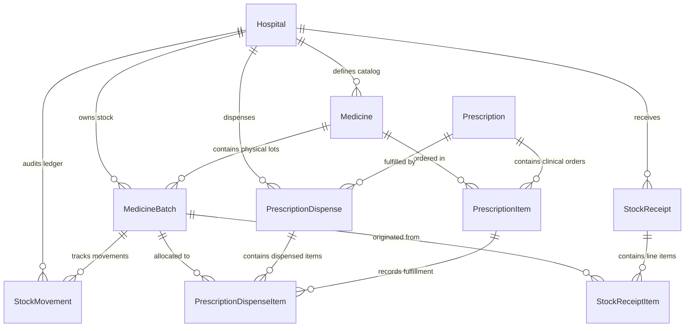

# PHASE 7 — TECHNICAL ARCHITECTURE SPECIFICATION
## Pharmacy & Inventory Management
## MedCore HMS

---

## 1. Architectural Overview & Context

MedCore HMS employs a modular NestJS monolith with PostgreSQL (Supabase) and Next.js 15 App Router.

```
┌─────────────────────────────────────────────────────────────────────────────┐
│                           Next.js 15 Web Frontend                           │
│  ┌──────────────────────┐  ┌──────────────────────┐  ┌───────────────────┐  │
│  │   Pharmacy Queue     │  │  FEFO Dispense Modal │  │   Stock Intake    │  │
│  │ /dashboard/pharmacy  │  │   Batch Allocation   │  │   Goods Receipt   │  │
│  └──────────┬───────────┘  └──────────┬───────────┘  └─────────┬─────────┘  │
└─────────────┼─────────────────────────┼────────────────────────┼────────────┘
              │                         │                        │
       HTTPS / JWT (SupabaseAuthGuard + RolesGuard + TenantGuard)
              │                         │                        │
┌─────────────▼─────────────────────────▼────────────────────────▼────────────┐
│                             NestJS 11 API Gateway                           │
│                                                                             │
│  ┌───────────────────────────────────────────────────────────────────────┐  │
│  │                         PharmacyModule                                │  │
│  │  ┌─────────────────────┐  ┌────────────────────┐  ┌─────────────────┐ │  │
│  │  │ DispensingService   │  │ InventoryService   │  │  LedgerService  │ │  │
│  │  │ • FEFO Allocation   │  │ • Stock Intake     │  │  • Immutability │ │  │
│  │  │ • Lock Orchestration│  │ • Batch Expiry     │  │  • Double-entry │ │  │
│  │  │ • Status Transition │  │ • Reorder Checks   │  │    Movements    │ │  │
│  │  └─────────────────────┘  └────────────────────┘  └─────────────────┘ │  │
│  └───────────────────────────────────┬───────────────────────────────────┘  │
│                                      │                                      │
│                Prisma Tenant Client / Raw Client Transaction                │
└──────────────────────────────────────┼──────────────────────────────────────┘
                                       │
┌──────────────────────────────────────▼──────────────────────────────────────┐
│                        Supabase PostgreSQL 16                               │
│                                                                             │
│  ┌───────────────────┐      ┌────────────────────┐      ┌────────────────┐  │
│  │   MedicineBatch   │◄────►│   StockMovement    │◄────►│  StockReceipt  │  │
│  │ (Physical Lots)   │      │ (Append-Only Audit)│      │  (Supplier GRN)│  │
│  └─────────▲─────────┘      └────────────────────┘      └────────────────┘  │
│            │                                                                │
│  ┌─────────▼─────────┐      ┌────────────────────┐      ┌────────────────┐  │
│  │     Medicine      │◄────►│  PrescriptionItem  │◄────►│  Prescription  │  │
│  │ (Master Catalog)  │      │(Prescribed/Disp'd) │      │ (Clinical Order│  │
│  └───────────────────┘      └────────────────────┘      └────────────────┘  │
└─────────────────────────────────────────────────────────────────────────────┘
```

---

## 2. Entity-Relationship Model (ERD)



---

## 3. Database Schema Extensions (Prisma Proposed)

### 3.1 Schema Modifications to Existing Models

#### 1. `PrescriptionStatus` Enum
Add `PARTIALLY_DISPENSED` to represent incomplete fulfillment:
```prisma
enum PrescriptionStatus {
  DRAFT
  ISSUED
  PARTIALLY_DISPENSED
  DISPENSED
  CANCELLED
}
```

#### 2. `MedicineBatch` Model Enhancement
Add direct `hospitalId` to optimize tenant scoping and row-level locks, plus add unique constraint scoped to hospital:
```prisma
model MedicineBatch {
  id                String    @id @default(uuid())
  hospitalId        String
  hospital          Hospital  @relation(fields: [hospitalId], references: [id], onDelete: Cascade)
  medicineId        String
  medicine          Medicine  @relation(fields: [medicineId], references: [id], onDelete: Cascade)
  batchNumber       String
  manufacturingDate DateTime
  expiryDate        DateTime
  initialQuantity   Int
  currentQuantity   Int
  unitCost          Decimal   @db.Decimal(10, 2)
  mrp               Decimal   @db.Decimal(10, 2)
  isQuarantined     Boolean   @default(false)

  createdAt         DateTime  @default(now())
  updatedAt         DateTime  @updatedAt

  movements         StockMovement[]
  dispenseItems     PrescriptionDispenseItem[]
  receiptItems      StockReceiptItem[]

  @@unique([hospitalId, medicineId, batchNumber])
  @@index([hospitalId, medicineId])
  @@index([hospitalId, expiryDate])
  @@index([hospitalId, isQuarantined])
}
```

### 3.2 New Entities Proposed for Phase 7

#### 1. `StockMovementType` Enum
```prisma
enum StockMovementType {
  PURCHASE_RECEIPT     // Stock added via supplier goods receipt
  DISPENSE             // Stock deducted via prescription dispensing
  DISPENSE_RETURN      // Stock restored due to dispensary return
  ADJUSTMENT_INCREASE  // Physical audit positive reconciliation
  ADJUSTMENT_DECREASE  // Physical audit negative reconciliation
  DAMAGE_WRITEOFF      // Broken, damaged, or unsealed stock removal
  EXPIRY_DISPOSAL      // Expired medication destroyed or returned to vendor
}
```

#### 2. `StockMovement` Model (The Append-Only Ledger)
```prisma
model StockMovement {
  id             String            @id @default(uuid())
  hospitalId     String
  hospital       Hospital          @relation(fields: [hospitalId], references: [id], onDelete: Cascade)
  batchId        String
  batch          MedicineBatch     @relation(fields: [batchId], references: [id], onDelete: Cascade)
  medicineId     String
  movementType   StockMovementType
  quantity       Int               // Signed: positive for intake, negative for deduction
  balanceBefore  Int               // Quantity on batch immediately prior to movement
  balanceAfter   Int               // Quantity on batch immediately post movement
  referenceType  String?           // e.g. "PRESCRIPTION", "STOCK_RECEIPT", "STOCK_ADJUSTMENT"
  referenceId    String?           // UUID of related entity
  reason         String?           // Mandatory for adjustments, optional for sales
  performedById  String
  performedBy    User              @relation(fields: [performedById], references: [id])
  createdAt      DateTime          @default(now())

  @@index([hospitalId, batchId])
  @@index([hospitalId, medicineId])
  @@index([hospitalId, movementType])
  @@index([hospitalId, createdAt])
}
```

#### 3. `StockReceipt` Model (Goods Receipt Note / Purchase Intake)
```prisma
model StockReceipt {
  id             String             @id @default(uuid())
  hospitalId     String
  hospital       Hospital           @relation(fields: [hospitalId], references: [id], onDelete: Cascade)
  receiptNumber  String             // Format: GRN-{HOSP}-{YYYY}-{SEQ6}
  supplierName   String
  invoiceNumber  String
  invoiceDate    DateTime
  receivedDate   DateTime           @default(now())
  totalCost      Decimal            @db.Decimal(12, 2)
  notes          String?
  receivedById   String
  receivedBy     User               @relation(fields: [receivedById], references: [id])
  items          StockReceiptItem[]

  createdAt      DateTime           @default(now())
  updatedAt      DateTime           @updatedAt

  @@unique([hospitalId, receiptNumber])
  @@index([hospitalId, receivedDate])
}

model StockReceiptItem {
  id                String       @id @default(uuid())
  receiptId         String
  receipt           StockReceipt @relation(fields: [receiptId], references: [id], onDelete: Cascade)
  batchId           String
  batch             MedicineBatch @relation(fields: [batchId], references: [id], onDelete: Cascade)
  medicineId        String
  batchNumber       String
  quantityReceived  Int
  unitCost          Decimal      @db.Decimal(10, 2)
  mrp               Decimal      @db.Decimal(10, 2)
  expiryDate        DateTime

  createdAt         DateTime     @default(now())

  @@index([receiptId])
  @@index([batchId])
}
```

#### 4. `PrescriptionDispense` Model (Dispensing Execution Header & Items)
```prisma
model PrescriptionDispense {
  id             String                     @id @default(uuid())
  hospitalId     String
  hospital       Hospital                   @relation(fields: [hospitalId], references: [id], onDelete: Cascade)
  prescriptionId String
  prescription   Prescription               @relation(fields: [prescriptionId], references: [id], onDelete: Cascade)
  dispenseNumber String                     // Format: DSP-{HOSP}-{YYYY}-{SEQ6}
  dispensedById  String
  dispensedBy    User                       @relation(fields: [dispensedById], references: [id])
  dispensedAt    DateTime                   @default(now())
  notes          String?
  idempotencyKey String?

  items          PrescriptionDispenseItem[]

  createdAt      DateTime                   @default(now())

  @@unique([hospitalId, dispenseNumber])
  @@unique([hospitalId, idempotencyKey])
  @@index([hospitalId, prescriptionId])
}

model PrescriptionDispenseItem {
  id                 String               @id @default(uuid())
  dispenseId         String
  dispense           PrescriptionDispense @relation(fields: [dispenseId], references: [id], onDelete: Cascade)
  prescriptionItemId String
  prescriptionItem   PrescriptionItem     @relation(fields: [prescriptionItemId], references: [id], onDelete: Cascade)
  batchId            String
  batch              MedicineBatch        @relation(fields: [batchId], references: [id], onDelete: Cascade)
  quantityDispensed  Int
  unitPrice          Decimal              @db.Decimal(10, 2) // MRP or sell price snapshot

  createdAt          DateTime             @default(now())

  @@index([dispenseId])
  @@index([prescriptionItemId])
  @@index([batchId])
}
```

---

## 4. FEFO Allocation Engine

When a pharmacist reviews a prescription item to fulfill, the system computes the recommended allocation:

```typescript
interface BatchAllocation {
  batchId: string;
  batchNumber: string;
  expiryDate: Date;
  availableQuantity: number;
  allocatedQuantity: number;
  unitCost: number;
  mrp: number;
}

export function computeFefoAllocation(
  requestedQuantity: number,
  candidateBatches: Array<{
    id: string;
    batchNumber: string;
    expiryDate: Date;
    currentQuantity: number;
    isQuarantined: boolean;
    createdAt: Date;
    unitCost: number;
    mrp: number;
  }>,
  currentDate: Date = new Date(),
): { allocations: BatchAllocation[]; unfulfilledQuantity: number } {
  // 1. Filter out expired, quarantined, or empty batches
  const validBatches = candidateBatches.filter(
    (b) => !b.isQuarantined && b.expiryDate > currentDate && b.currentQuantity > 0,
  );

  // 2. Sort by FEFO: Earliest expiry date first; tie-break by earliest creation date (FIFO)
  validBatches.sort((a, b) => {
    const expiryDiff = a.expiryDate.getTime() - b.expiryDate.getTime();
    if (expiryDiff !== 0) return expiryDiff;
    return a.createdAt.getTime() - b.createdAt.getTime();
  });

  const allocations: BatchAllocation[] = [];
  let remainingToFulfill = requestedQuantity;

  for (const batch of validBatches) {
    if (remainingToFulfill <= 0) break;

    const alloc = Math.min(remainingToFulfill, batch.currentQuantity);
    allocations.push({
      batchId: batch.id,
      batchNumber: batch.batchNumber,
      expiryDate: batch.expiryDate,
      availableQuantity: batch.currentQuantity,
      allocatedQuantity: alloc,
      unitCost: Number(batch.unitCost),
      mrp: Number(batch.mrp),
    });

    remainingToFulfill -= alloc;
  }

  return {
    allocations,
    unfulfilledQuantity: remainingToFulfill,
  };
}
```

---

## 5. Concurrency & Locking Architecture

To guarantee absolute consistency under concurrent requests:

```
[Incoming Dispense Request]
           │
           ▼
[Check Idempotency-Key] ──(Key exists)──► Return Previous Receipt (No Op)
           │
     (Key not seen)
           │
           ▼
[BEGIN PostgreSQL Transaction via prisma.raw.$transaction]
           │
           ├──► 1. Lock Prescription:
           │       SELECT id, status FROM "Prescription" WHERE id = :id FOR UPDATE;
           │       Verify status IN ('ISSUED', 'PARTIALLY_DISPENSED')
           │
           ├──► 2. Lock PrescriptionItems:
           │       SELECT id, "dispensedQuantity", quantity FROM "PrescriptionItem"
           │       WHERE id IN (:itemIds) ORDER BY id ASC FOR UPDATE;
           │
           ├──► 3. Lock Target MedicineBatches in Deterministic ID Order (Prevents Deadlocks):
           │       SELECT id, "currentQuantity", "expiryDate", "isQuarantined"
           │       FROM "MedicineBatch" WHERE id IN (:batchIds) ORDER BY id ASC FOR UPDATE;
           │
           ├──► 4. Clinical Invariant Checks:
           │       • batch.isQuarantined === false
           │       • batch.expiryDate > CURRENT_DATE
           │       • batch.currentQuantity >= allocationQuantity
           │       • (dispensedQuantity + allocation) <= prescriptionItem.quantity
           │
           ├──► 5. Apply Mutations Atomically:
           │       • UPDATE "MedicineBatch" SET "currentQuantity" = "currentQuantity" - allocation
           │       • INSERT INTO "StockMovement" (PURCHASE_RECEIPT / DISPENSE, balances)
           │       • UPDATE "PrescriptionItem" SET "dispensedQuantity" = "dispensedQuantity" + allocation
           │       • INSERT INTO "PrescriptionDispense" & "PrescriptionDispenseItem"
           │       • UPDATE "Prescription" status:
           │            IF all items fully dispensed -> DISPENSED
           │            ELSE -> PARTIALLY_DISPENSED
           │
           └──► 6. INSERT INTO "AuditLog"
           │
[COMMIT Transaction]
           │
           ▼
[Return Dispense Receipt & Print Payload]
```

### Deadlock Prevention
Deadlocks occur when Transaction 1 locks Batch A then Batch B, while Transaction 2 locks Batch B then Batch A.
**Rule**: All batch rows MUST be locked using `WHERE id IN (...) ORDER BY id ASC FOR UPDATE`. This guarantees a single global lock acquisition order across all parallel database sessions.
